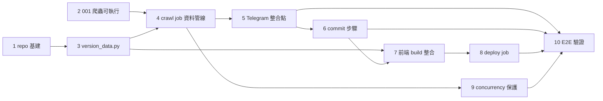

# 每日排程與 GitHub Pages 部署 — 開發規格

> **對應 Roadmap**：Tech Decision §4.1 初期任務 P0「crawl.yml：每日 cron + commit 資料 + Pages 部署」（`docs/tech-decisions/tech-decision-原價屋商品價格追蹤-2026-08-15.md`）
> **技術決策**：`docs/tech-decisions/tech-decision-原價屋商品價格追蹤-2026-08-15.md`（§3.2 架構概覽、§3.3 專案結構、§4.2 Spike「GitHub Pages JSON 快取」、§5 風險登錄）
> **操作流程**：`docs/interaction-flows/002-scheduler-and-pages-deploy.md`
> **BDD**：`docs/bdds/002-scheduler-and-pages-deploy.feature`
> **測試計畫**：尚未產出（本功能完成後由 test-plan-generator 補上）
> **狀態**：設計完成，待開發

---

## 概述

讓 GitHub Actions 每日 06:00 UTC（台北 14:00）自動執行「checkout → setup-python 3.12 → pip install → 爬蟲（001 整合）→ 異動判定與版本化 → Telegram 通知整合點（006，commit 前）→ commit data/（含 telegram.json）→ 前端 Vite build → 部署 GitHub Pages」完整管線；資料有異動才 commit 並遞增 cache-busting 版本號，維護者可隨時以 workflow_dispatch 手動補爬。核心包含：

1. **crawl.yml 工作流**：cron `'0 6 * * *'` + `workflow_dispatch` 雙觸發、concurrency 並發控制、crawl / deploy 雙 job 切分（失敗即停止、天然隔離「資料寫入」與「部署」兩階段權限）。
2. **scripts/version_data.py**：爬蟲產出（001）→ 資料異動判定 → cache-busting 版本化（`items.v{n}.json` + `meta.json.version`）的自訂 script。
3. **scripts/telegram_hook.py**：爬蟲完成後、資料 commit 前的 Telegram 通知整合點（006 預留，未實作不中斷 run；telegram.json 異動併入本次 commit）。
4. **前端 build 整合合約**：Vite build 讀取 `data/meta.json` 注入 `__DATA_VERSION__` 並將資料檔複製進 `dist/data/`，前端以版本化檔名讀取資料（003-005 消費此合約）。
5. **GitHub Pages 部署**：`actions/configure-pages` + `upload-pages-artifact` + `deploy-pages`，Pages Source 設為「GitHub Actions」。

```mermaid
flowchart TD
    Cron([cron 每日 06:00 UTC]) --> WF
    Manual([維護者 workflow_dispatch]) --> WF
    WF[觸發與並發控制<br/>concurrency group + cancel-in-progress: false] --> Job1
    subgraph Job1[crawl job：資料收集]
        C1[checkout] --> C2[setup-python 3.12]
        C2 --> C3[pip install -e ./crawler]
        C3 --> C4[python -m crawler.main<br/>001: items.json + meta.json]
        C4 --> C5[python scripts/version_data.py<br/>diff → items.v{n+1}.json + meta.version]
        C5 --> TG[[telegram_hook.py<br/>006 預留（commit 前）]]
        TG -->|changed=true| C6[commit data/ + push<br/>items.v{n}.json + meta.json + telegram.json]
        TG -->|changed=false| C7[跳過 commit]
    end
    Job1 -->|needs: crawl| Job2
    subgraph Job2[deploy job：前端 build + Pages]
        D1[setup-node 22 + npm ci] --> D2[Vite build<br/>注入 __DATA_VERSION__ + 複製 data 至 dist]
        D2 --> D3[configure-pages]
        D3 --> D4[upload-pages-artifact]
        D4 --> D5[deploy-pages]
    end
    Job2 --> Done([完成：頁面已更新])

    C4 -.失敗.-> E1[crawl job 失敗 → deploy 不啟動<br/>舊資料不覆寫（001 store 原子寫入）]:::err
    C6 -.失敗.-> E2[commit 失敗 → run 失敗<br/>異動停留工作目錄]:::err
    D2 -.失敗.-> E3[build 失敗 → 不執行 deploy]:::err
    D5 -.失敗.-> E4[部署失敗 → 線上維持上次成功版本]:::err

    classDef err fill:#fff0f0,stroke:#e00
```

---

## 1. 工作流實作規格（原「後端實作規格」）

本功能為 CI/CD 基礎架構，以 GitHub Actions 工作流取代傳統後端服務；「後端」對應之物即為 `.github/workflows/crawl.yml` 與輔助 script。

### 1.1 依賴與檔案改動總覽

| 依賴 | 說明 |
|------|------|
| `actions/checkout@v4` | 取回主分支最新程式碼（含版控的 `data/`） |
| `actions/setup-python@v5` | Python 3.12（含 pip cache，`cache-dependency-path: crawler/pyproject.toml`） |
| `actions/setup-node@v4` | Node 22 LTS（含 npm cache，`cache-dependency-path: web/package-lock.json`） |
| `actions/configure-pages@v5` / `upload-pages-artifact@v3` / `deploy-pages@v4` | GitHub Pages 部署（Actions source） |
| 爬蟲套件 httpx / selectolax | 由 001 的 `crawler/pyproject.toml` 提供，工作流僅 `pip install -e ./crawler` |

```
CoolPCTracker/
├── .github/workflows/
│   └── crawl.yml                  ← 新增：完整工作流（觸發/並發/資料/部署）
├── scripts/
│   ├── version_data.py            ← 新增：異動判定 + cache-busting 版本化（本功能核心自訂 script）
│   └── telegram_hook.py           ← 新增：006 通知整合點佔位
├── crawler/
│   └── main.py                    ← 既有（001 產出）：以 `python -m crawler.main` 呼叫，輸出 data/items.json + data/meta.json
├── data/                          ← git 版控：items.json（001 來源真相）、items.v{n}.json（快取版本化快照）、meta.json（version/crawled_at/計數）
└── web/
    └── vite.config.ts             ← 修改（本功能定義合約，003-005 實作）：讀 ../data/meta.json 注入 __DATA_VERSION__、build 時複製 data/*.json 至 dist/data/
```

### 1.2 觸發與並發控制

| 設定 | 值 | 說明 |
|------|-----|------|
| `on.schedule.cron` | `'0 6 * * *'` | 每日 06:00 **UTC**（= 台北 14:00），錯開原價屋上午更新；GitHub 不提供排程 SLA（可能延遲或偶發跳過，以手動觸發補救） |
| `on.workflow_dispatch` | `{}` | Actions 頁面對 crawl.yml 出現「Run workflow」按鈕，維護者隨時手動補爬；與 cron 共用同一工作流，執行相同管線 |
| `concurrency.group` | `pages-deploy` | cron 與 workflow_dispatch 皆觸發同一工作流 → 同 group；**同一時間僅允許一個 run 執行寫入階段** |
| `concurrency.cancel-in-progress` | `false` | 新 run 進入 pending 等待而非取消進行中的 run → 序列化執行，避免 commit 衝突與版本號重複（BDD @edge-case 並發場景） |
| `permissions.contents` | `write` | crawl job：允許 commit data/ 並 push（GITHUB_TOKEN） |
| `permissions.pages` / `id-token` | `write` | deploy job：`actions/deploy-pages` 所需 |

### 1.3 Job 與 Step 規格

**Job 1 `crawl`（資料收集）** — 任一 step 失敗即整個 job 失敗，`deploy` job 因 `needs` 不啟動：

| 步驟 | 動作 | 產出 / 行為 |
|------|------|-------------|
| 1 | `actions/checkout@v4`（`fetch-depth: 1`） | 工作目錄含最新程式碼與上次 `data/items.v{n}.json`（供 diff 比對） |
| 2 | `actions/setup-python@v5`（3.12 + pip cache） | Python 3.12 環境 |
| 3 | `pip install -e ./crawler` | 依 `crawler/pyproject.toml` 安裝 httpx/selectolax 等 |
| 4 | `python -m crawler.main`（001 整合） | 寫出 `data/items.json` + `data/meta.json`（含 `crawled_at`、各分類計數、失敗分類） |
| 5 | `python scripts/version_data.py`（`id: version`） | 異動判定 + 版本化；輸出 `changed=true|false`、`version=N` |
| 6 | `python scripts/telegram_hook.py` + `continue-on-error: true` | 006 整合點：每 run 皆觸發（**資料 commit 之前**，telegram.json 異動可併入本次 commit）；未實作不中斷 |
| 7 | commit data/（`if: steps.version.outputs.changed == 'true'`） | bot 身分 commit + push，範圍 `data/`（`items.v{n}.json` + `meta.json` + `telegram.json`（有變更時））；無異動則整個跳過（不產生空 commit） |

**Job 2 `deploy`（前端 build + Pages）** — `needs: crawl`，crawl 失敗則不啟動：

| 步驟 | 動作 | 產出 / 行為 |
|------|------|-------------|
| 1 | `actions/checkout@v4` | 取回含最新資料 commit 的程式碼（若 crawl 有 push） |
| 2 | `actions/setup-node@v4`（22 + npm cache） | Node 環境 |
| 3 | `cd web && npm ci && npm run build` | Vite build；讀 `../data/meta.json` 注入 `__DATA_VERSION__`；複製 `items.v{n}.json`、`meta.json` 至 `dist/data/` |
| 4 | `actions/configure-pages@v5` | 初始化 Pages 部署環境 |
| 5 | `actions/upload-pages-artifact@v3`（`path: web/dist`） | 上傳靜態產物 |
| 6 | `actions/deploy-pages@v4`（`id: deployment`） | 發布至 GitHub Pages，輸出 `page_url` 供 environment URL |

**權限最小化**：crawl job 僅需 `contents: write`（不給 pages/id-token）；deploy job 僅需 `pages: write` + `id-token: write`（不需 contents write）。避免單一 job 擁有過大權限。

### 1.4 crawl.yml Code Skeleton

```yaml
# .github/workflows/crawl.yml
name: Crawl & Deploy

on:
  schedule:
    - cron: '0 6 * * *'        # 每日 06:00 UTC（台北 14:00）
  workflow_dispatch: {}        # 維護者手動補爬

# ── 權限（per-job 最小化，見 1.3）──
permissions: {}

concurrency:
  group: pages-deploy          # 排程+手動並發時序列化，避免 commit 衝突
  cancel-in-progress: false    # 新 run 等待，不取消進行中的 run

jobs:
  crawl:
    runs-on: ubuntu-latest
    permissions:
      contents: write          # 僅資料 commit 所需
    steps:
      - name: Checkout
        uses: actions/checkout@v4
        # fetch-depth: 1（data/ 已 git 版控，工作目錄即含上次 items.v{n}.json）

      - name: Setup Python 3.12
        uses: actions/setup-python@v5
        with:
          python-version: '3.12'
          cache: pip
          cache-dependency-path: crawler/pyproject.toml

      - name: Install crawler deps
        run: pip install -e ./crawler

      - name: Run crawler (feature 001)
        run: python -m crawler.main
        # 產出 data/items.json（來源真相）+ data/meta.json（crawled_at/計數/失敗分類）

      - name: Version data (diff + cache-busting)
        id: version
        run: python scripts/version_data.py
        # 輸出 changed=true|false、version=N（見 1.5）

      - name: Telegram notification hook (feature 006 placeholder)
        run: python scripts/telegram_hook.py
        continue-on-error: true    # 整合點尚未實作時不中斷 run（BDD @integration @placeholder）
        # 位於 commit 之前：telegram.json（offset/追蹤清單）異動可併入本次 commit（006 契約）

      - name: Commit data changes
        if: steps.version.outputs.changed == 'true'   # 無異動 → 跳過（不產生空 commit）
        env:
          GH_TOKEN: ${{ github.token }}
        run: |
          git config user.name "coolpc-tracker[bot]"
          git config user.email "coolpc-tracker[bot]@users.noreply.github.com"
          git add data/          # items.v{n}.json + meta.json + telegram.json（有變更時）
          git commit -m "chore(data): 更新商品資料 v${{ steps.version.outputs.version }}"
          git pull --rebase        # 併入並發期間他人對 main 的異動；實質衝突 → 失敗
          git push
        # push 失敗（權限/衝突）→ step 失敗 → run 失敗、異動停留工作目錄（BDD @error-handling）

  deploy:
    needs: crawl                  # crawl 失敗 → deploy 不啟動（BDD: 爬蟲失敗不部署）
    runs-on: ubuntu-latest
    permissions:
      pages: write
      id-token: write
    environment:
      name: github-pages
      url: ${{ steps.deployment.outputs.page_url }}
    steps:
      - name: Checkout
        uses: actions/checkout@v4

      - name: Setup Node 22
        uses: actions/setup-node@v4
        with:
          node-version: '22'
          cache: npm
          cache-dependency-path: web/package-lock.json

      - name: Install & build frontend
        env:
          BASE_PATH: /${{ github.event.repository.name }}/   # Pages project site 基底路徑
        run: |
          cd web
          npm ci
          npm run build    # vite.config.ts 讀 ../data/meta.json 注入 __DATA_VERSION__、複製 data/*.json 至 dist/data/
        # build 失敗 → deploy job 失敗 → 後續 step 不執行（BDD: build 失敗不部署）

      - name: Setup Pages
        uses: actions/configure-pages@v5

      - name: Upload Pages artifact
        uses: actions/upload-pages-artifact@v3
        with:
          path: web/dist

      - name: Deploy to GitHub Pages
        id: deployment
        uses: actions/deploy-pages@v4
        # 部署失敗 → run 標記失敗；GitHub Pages 保留上次成功部署（BDD: 部署失敗保留上次版本）
```

**關鍵設計註記**：
- **雙 job 切分 = 失敗保護**：`needs: crawl` 讓爬蟲失敗自動阻斷部署；build 與 deploy 同一 job 內依 step 順序天然「build 失敗不部署」。全部對應 BDD @error-handling 場景，無需 `if: failure()` 等額外條件。
- **GITHUB_TOKEN push 不觸發新 workflow run**（GitHub 內建防迴圈），與 cron/dispatch 並無衝突。
- `git pull --rebase` 為防呆（其他 contributor 同時 push 到 main）；若 data/ 有實質衝突則失敗，符合「commit 失敗 → run 失敗」的 BDD 行為。

### 1.5 scripts/version_data.py（自訂 script：異動判定 + cache-busting）

**輸入**（工作目錄內，爬蟲步驟已產出）：`data/items.json`、`data/meta.json`。

**流程**：
1. 讀 `meta.json` 取得 `version`（prev；不存在視為 0）。
2. 若 `data/items.v{prev}.json` 不存在（**首次執行**）→ 判定為異動，`next = 1`。
3. 否則以 **canonical JSON 僅比較 `items` payload**（不含 `crawled_at`，避免時間戳造成永遠「有異動」）：
   - 有異動 → `next = prev + 1`，寫 `data/items.v{next}.json`（含 `crawled_at` 與 `items`），更新 `meta.json.version = next`。
   - 無異動 → **不動任何檔案**，輸出 `changed=false`（工作目錄無變化 → workflow 跳過 commit）。
4. 以 `changed=true|false` 與 `version=N` 輸出，供 workflow 分支。

```python
#!/usr/bin/env python3
"""data/ 異動判定與 cache-busting 版本化（功能 002）。

- 比較基準：data/items.v{prev}.json（git 版控，工作目錄即可取得）
- 比較範圍：僅 items payload（crawled_at 不參與比對）
- 輸出：changed=true|false、version=N（供 crawl.yml 分支決定是否 commit）
"""
import json
from pathlib import Path

DATA = Path("data")


def canonical(obj: object) -> str:
    return json.dumps(obj, ensure_ascii=False, sort_keys=True)


def main() -> None:
    meta = json.loads((DATA / "meta.json").read_text(encoding="utf-8"))
    items = json.loads((DATA / "items.json").read_text(encoding="utf-8"))

    prev = int(meta.get("version", 0))
    prev_file = DATA / f"items.v{prev}.json"

    changed = False
    if not prev_file.exists():
        changed = True                                # 首次執行 → 建立 items.v1.json
    else:
        prev_payload = json.loads(prev_file.read_text(encoding="utf-8"))
        changed = canonical(items["items"]) != canonical(prev_payload["items"])

    version = prev
    if changed:
        version = prev + 1
        (DATA / f"items.v{version}.json").write_text(
            json.dumps({"crawled_at": meta["crawled_at"], "items": items["items"]},
                       ensure_ascii=False, separators=(",", ":")),
            encoding="utf-8")
        meta["version"] = version
        (DATA / "meta.json").write_text(
            json.dumps(meta, ensure_ascii=False, indent=2), encoding="utf-8")

    print(f"changed={'true' if changed else 'false'}")
    print(f"version={version}")
    # 若以 shell 讀取輸出，改用 $GITHUB_OUTPUT 寫入（skeleton 以 stdout 示意）


if __name__ == "__main__":
    main()
```

**行為對照 BDD**：
- Scenario Outline（prev 1→2 / 5→6 / 9→10）：`next = prev + 1`，無上限、不跳號。✓
- 資料檔含 `crawled_at`：寫入 `items.v{n}.json` 頂層。✓
- `meta.json` 記錄版本號。✓
- 首次執行建立 `items.v1.json` + `meta.json`。✓
- 無異動 → 跳過 commit（配合 §1.4 step 6 的 `if`）。✓

### 1.6 Telegram 通知整合點（功能 006 預留）

| 項目 | 規格 |
|------|------|
| 位置 | crawl job 中**資料 commit 之前**的 step（爬蟲 + version_data 之後、commit 之前）；確保 telegram.json 異動與 items.json 於同一次 commit 提交（006 契約「與 items.json 一併 commit」，對應 Interaction Flow 006 §B5） |
| 觸發條件 | **每 run 皆觸發**（資料異動或無異動皆會經過）；爬蟲成功為前提 |
| 佔位行為 | `scripts/telegram_hook.py`：讀不到 `TELEGRAM_BOT_TOKEN` 時輸出 notice 並以 0 結束；`continue-on-error: true` 確保未實作時不中斷 run |
| 006 接入點 | 006 實作時置換 script 主體：讀取 secret token、呼叫 `crawler.telegram_bot` 每日流程（getUpdates 輪詢 + 目標價比對 + 降價/消失通知）並以 `asyncio.run(run_telegram_phase(...))` 驅動；依 006 BDD，token 無效或網路失敗時僅記 log、**不影響資料爬取與 commit** |

```python
#!/usr/bin/env python3
"""Telegram 通知整合點（功能 006 預留）。

- 工作流每 run 於爬蟲+資料 commit 前呼叫（telegram.json 異動併入本次 commit）。
- 006 實作前：輸出 placeholder 並回傳 0（不中斷 run）。
- 006 實作後：讀取 TELEGRAM_BOT_TOKEN 呼叫 crawler.telegram_bot 每日流程；
  token 不存在/失效/網路失敗時記錄錯誤仍以成功結束（依 006 BDD @error-handling）。
"""
import os
import sys


def main() -> int:
    token = os.environ.get("TELEGRAM_BOT_TOKEN")
    if not token:
        print("[telegram-hook] 未設定 TELEGRAM_BOT_TOKEN；整合點已觸發但尚未啟用（功能 006 預留）")
        return 0
    # TODO(006): from crawler.telegram_bot import run_daily; run_daily()
    print("[telegram-hook] placeholder：006 實作待接入")
    return 0


if __name__ == "__main__":
    sys.exit(main())
```

### 1.7 前端 Build 整合合約（003-005 消費）

本功能定義 build 期資料注入與檔案複製合約，前端實作屬 003-005：

```ts
// web/vite.config.ts（合約骨架，003 起實作）
import { readFileSync } from "node:fs";
import { defineConfig } from "vite";

const meta = JSON.parse(readFileSync("../data/meta.json", "utf-8"));
const version: number = meta.version;                 // 由 version_data.py 維護

export default defineConfig({
  base: process.env.BASE_PATH ?? "/CoolPCTracker/",   // workflow 帶入 repo name
  define: {
    __DATA_VERSION__: JSON.stringify(version),        // 建置時注入 → 前端 fetch items.v{n}.json
  },
  // build 收尾：把 ../data/items.v{n}.json、../data/meta.json 複製至 dist/data/
  // （與 003-005 前端 fetch 路徑一致；P1 階段另複製 ../data/items.json 供 data/items.json 讀取）
  // （小 plugin 或 vite-plugin-static-copy；實作屬 003）
});
```

```ts
// 前端資料讀取合約（003-005 使用）：
//   fetch(`${import.meta.env.BASE_URL}data/meta.json`)           → 版本、新鮮度（crawled_at）
//   fetch(`${import.meta.env.BASE_URL}data/items.v${__DATA_VERSION__}.json`) → 版本化商品檔（快取必然失效）
```

---

## 6. 邊界條件處理

BDD 之 @edge-case 與 @error-handling 全數反映如下（含 2 個 @business-rule 與 1 個 @integration 場景，因與失敗/跳過行為直接相關一併列出）：

| # | 情境 | BDD 來源 | 處理方式 | 實作點 |
|---|------|----------|----------|--------|
| 1 | **爬蟲執行失敗**（來源無法存取 / parser 失敗） | @error-handling @p0 | crawl job 失敗 → `deploy` job 因 `needs: crawl` **不啟動** → 不部署；`data/` 舊資料不被覆寫（001 store 原子寫入 + 健康檢查擋下驟降/0 商品） | §1.3、§1.4 job 切分 |
| 2 | **commit data/ 失敗**（push 權限不足 / 衝突） | @error-handling | commit step 失敗 → run 標記失敗；異動資料停留在工作目錄、未提交（GitHub 不自動 rollback） | §1.4 step 6 |
| 3 | **前端 build 失敗** | @error-handling | deploy job 失敗 → 後續 `upload-pages` / `deploy-pages` step 不執行 → 不部署 | §1.4 step「Install & build」 |
| 4 | **GitHub Pages 部署失敗** | @error-handling | `deploy-pages` 失敗 → run 標記失敗；Pages 平台保留**上次成功部署**版本，線上頁面不中斷 | §1.4 step 6（deploy job） |
| 5 | **cron 排程延遲或跳過**（GitHub 不保證 SLA） | @edge-case @manual-trigger | 維護者以 workflow_dispatch 手動觸發 → 執行與排程相同完整管線；`crawled_at` 更新為本次爬取時間（前端顯示新鮮度） | §1.2 觸發設定 |
| 6 | **排程與手動並發觸發** | @edge-case @robustness | `concurrency.group: pages-deploy` + `cancel-in-progress: false` → 同 group 同時僅一個 run 執行寫入；新 run 等待進行中的 run 完成後再執行 → 不發生 commit 衝突或版本號重複 | §1.2 concurrency |
| 7 | **首次執行（repo 尚無資料檔）** | @edge-case @initial-setup | `version_data.py`：`items.v{prev}` 不存在 → 視為異動 → 建立 `items.v1.json` 與 `meta.json`（含 `crawled_at` 與完整商品清單） | §1.5 |
| 8 | **資料無異動**（價格/狀態完全一致） | @business-rule @regression | `version_data.py` 輸出 `changed=false` → commit step 因 `if` 條件**跳過**（不產生空 commit）；前端仍完成 Vite build 並部署（重部署 idempotent，且可帶上前端程式碼異動） | §1.4 step 5-6、§1.5 |
| 9 | **Telegram 整合點尚未實作** | @integration @placeholder @p2 | 專屬 step 每 run 觸發（commit 前）；script 無 token 時 exit 0 + `continue-on-error: true` → 不中斷 run | §1.4 step 6、§1.6 |
| 10 | **cache-busting 版本遞增**（v1→v2 / v5→v6 / v9→v10） | @business-rule @regression | `next = prev + 1` 順序遞增；`meta.json.version` 同步更新；`items.v{n}.json` 內含本次 `crawled_at` | §1.5 |

**其他降級考量（非 BDD 但屬 CI/CD 穩健性）**：
- **快取命中與回源**：`items.v{n}.json` 檔名版本化 → 瀏覽器/Pages 快取（預設約 `max-age=600`）對該檔必然失效；`meta.json` 為固定檔名，內容僅 version/crawled_at/計數，體積小，允許短暫快取；若要嚴格新鮮度，前端以 `__DATA_VERSION__`（build 期注入）直接定位資料檔，不依賴 meta 即時性（見 §1.7 合約）。
- **Pages 頻寬額度**：免費 100GB/月，超限僅暫停服務，成本可控（Tech Decision 風險登錄）。
- **base 路徑**：Pages project site 掛載於 `/{repo}/`，build 以 `BASE_PATH` 注入，repo 改名時無需改前端程式碼。

---

## 8. 開發順序

| 步驟 | 內容 | 依賴 |
|------|------|------|
| 1 | repo 基建：`.github/workflows/crawl.yml` 骨架（triggers + concurrency + permissions 佔位）、`scripts/` 目錄建立 | - |
| 2 | 前置整合：001 爬蟲可於 repo 根以 `python -m crawler.main` 執行並產出 `data/items.json` + `data/meta.json` | 001 功能交付（外部） |
| 3 | `scripts/version_data.py`：diff 判定 + cache-busting 版本化 + `meta.version` 更新（含單元測試：v1→v2、v5→v6、首次執行、無異動） | #1 |
| 4 | crawl job 資料管線：checkout → setup-python 3.12 → pip install → 執行爬蟲 | #2, #3 |
| 5 | Telegram 整合點：`scripts/telegram_hook.py` 佔位 + `continue-on-error: true`（**commit 之前**，telegram.json 併入同次 commit） | #4 |
| 6 | commit 步驟：bot 身分（name/email 常數）、`if changed` 分支、`git pull --rebase` + push（範圍含 telegram.json） | #4, #5 |
| 7 | 前端 build 整合：web 骨架（003 提供）→ vite.config.ts 資料複製 + `__DATA_VERSION__` 注入（先以 `npm run build` 手動驗證資料檔進 dist/） | #3, #5 |
| 8 | deploy job：configure-pages / upload-pages-artifact / deploy-pages + environment + per-job permissions | #7 |
| 9 | concurrency 保護落地（`cancel-in-progress: false` 並發驗證） | #4 |
| 10 | E2E 驗證：首次 run 建立 `items.v1.json`；手動 `workflow_dispatch` 補爬；注入失敗（壞 token / 斷網 / build 出錯）驗證各失敗分支；確認 Pages 網址可存取且資料為最新 | #5, #6, #8, #9 |



（步驟間依賴為 DAG，無循環；基建 → 資料管線 → 提交/通知 → build → 部署 → 驗證。）

---

## 9. 基礎架構設定

### 9.1 GitHub Pages 設定（Actions source）

| 項目 | 設定 |
|------|------|
| Settings → Pages → Source | **「GitHub Actions」**（非 branch 部署；branch 模式無法由工作流控制部署時機與失敗行為） |
| 部署方式 | `actions/configure-pages@v5` + `actions/upload-pages-artifact@v3` + `actions/deploy-pages@v4` |
| Environment | 自動建立 `github-pages` environment，`url` 取自 `steps.deployment.outputs.page_url` |
| 網站位址 | `https://{owner}.github.io/CoolPCTracker/`（project site，含 repo name 路徑 → vite `base` 必須為 `/CoolPCTracker/`，以 workflow env `BASE_PATH` 注入，見 §1.7） |
| Actions 權限 | 若 repo 預設「Workflow permissions」為 read-only，需改為 read/write 或完全依賴 per-job `permissions` 宣告（本規格採後者） |
| 分支保護 | main 若設 branch protection：需允許 bot push（例外規則）或改用具 push 權限的 PAT 存為 secret；否則 commit 步驟會失敗（BDD commit 失敗場景） |

### 9.2 Secrets 需求

| Secret | 用途 | 現況 |
|--------|------|------|
| （無） | 現階段資料 commit 與 Pages 部署僅需自動產生的 `GITHUB_TOKEN` | 002 無需手動設定 secret |
| `TELEGRAM_BOT_TOKEN` | 006 Telegram 通知（Bot token；006 BDD Background「Bot 已從 GitHub Actions secret 取得有效 token」） | **後續（006）新增**，repo Secrets 設定；`telegram_hook.py` 以 env 讀取 |
| `TELEGRAM_ADMIN_CHAT_ID`（可選） | 007 健康監控管理員警報（商品數驟降 / 0 商品） | 後續（007）新增 |

> 設定方式：Settings → Secrets and variables → Actions → New repository secret。secret 由工作流 `env:` 帶入，不落入 log（GitHub 自動遮罩）。

### 9.3 資料 commit 策略

| 項目 | 設定 |
|------|------|
| bot 身分 | name: `coolpc-tracker[bot]`；email: `coolpc-tracker[bot]@users.noreply.github.com`（`git config` 於 commit step 內設定，僅影響該 run 工作目錄） |
| commit message | `chore(data): 更新商品資料 v{n}`（n = 本次 cache-busting 版本號，來自 version_data.py 輸出） |
| commit 範圍 | 僅 `data/`（`items.v{n}.json` + `meta.json` + `telegram.json`（有變更時））；爬蟲程式碼改動另以 PR 流程進行 |
| push 憑證 | `GITHUB_TOKEN`（contents: write）；token 觸發的 push **不會再觸發** workflow run（GitHub 防迴圈機制） |
| 無異動 | 完全不 commit（`if changed` 分支）→ 不產生空 commit、避免 churn |
| push 前 | `git pull --rebase` 併入並發期間 main 上其他人類 commit；實質衝突 → 失敗（保留工作目錄狀態供除錯） |
| 資料成長 | 001 store 採 delta 歷史（僅異動 append `[d,p]`）+ 本規格版本化快照；`items.v{n}.json` 每次異動會多一版檔案，但皆為增量、檔名唯一，可用 GitHub 檔案歷史管理 |

### 9.4 快取策略（items.v{n}.json 版本檔名 + 前端引用）

| 層級 | 策略 |
|------|------|
| 資料檔 | `data/items.v{n}.json`：**內容異動才遞增版本號**（`version_data.py`）；檔名含版本 → 瀏覽器/CDN 快取（GH Pages 預設 `Cache-Control: max-age=600`）對新版本必然失效 → 使用者永遠看到最新資料 |
| 版本注入 | build 期（`vite.config.ts`）讀 `data/meta.json` 注入 `__DATA_VERSION__` 進 JS bundle → 前端 `fetch(data/items.v${__DATA_VERSION__}.json)`，不依賴 meta.json 的即時性 |
| meta.json | 固定檔名、內容小（version/crawled_at/計數/失敗分類）；供前端顯示資料新鮮度；因檔名不變，允許預設快取（誤差 ≤ 10 分鐘可接受，且資料主體已由版本化檔名保證新鮮） |
| 前端資源 | Vite build 產物（`dist/`）含 content hash 檔名 → 前端 bundle 快取安全；`index.html` 不設長快取 |
| base path | `BASE_PATH = /{repo}/` 由 workflow 注入，repo 改名時僅需改 repo 名稱 |

---

## 附錄 A：BDD Scenario 覆蓋矩陣

| BDD Scenario | 對應位置 |
|---|---|
| 1. 每日排程觸發且資料有異動時完成爬蟲與部署 | §1.2、§1.3、§1.4（cron、依序 steps、commit、build、deploy、成功結束） |
| 2. 維護者手動觸發補爬成功 | §1.2（workflow_dispatch 共用管線） |
| 3. 資料異動時以遞增版本號更新 cache-busting 資料檔（v1→v2 / v5→v6 / v9→v10） | §1.5（next = prev + 1、meta.version、crawled_at） |
| 4. 資料無異動時跳過 commit 仍完成部署 | §1.4 step 5-6（if changed）、§1.5、§6 #8 |
| 5. 爬蟲完成後觸發 Telegram 通知整合點（006 預留） | §1.4 step 6、§1.6、§6 #9 |
| 6. 爬蟲執行失敗時保留舊資料且不部署 | §1.3（needs: crawl）、§6 #1 |
| 7. 資料 commit 失敗時工作流失敗 | §1.4 step 6、§6 #2 |
| 8. 前端 build 失敗時不部署 | §1.4 deploy job、§6 #3 |
| 9. 部署失敗時保留上次部署版本 | §1.4 deploy step、§6 #4 |
| 10. cron 排程延遲或跳過時可手動補爬 | §1.2、§6 #5 |
| 11. 排程與手動並發觸發時不產生 commit 衝突 | §1.2 concurrency、§6 #6 |
| 12. 首次執行建立初始資料檔（items.v1.json + meta.json） | §1.5、§6 #7 |
