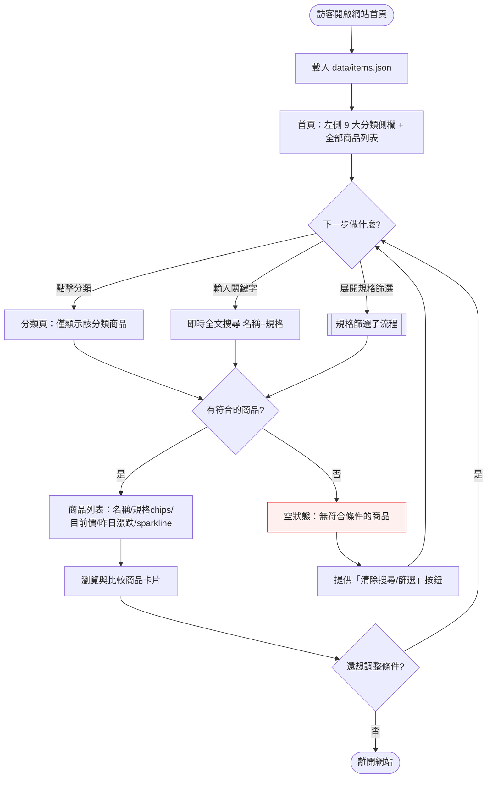
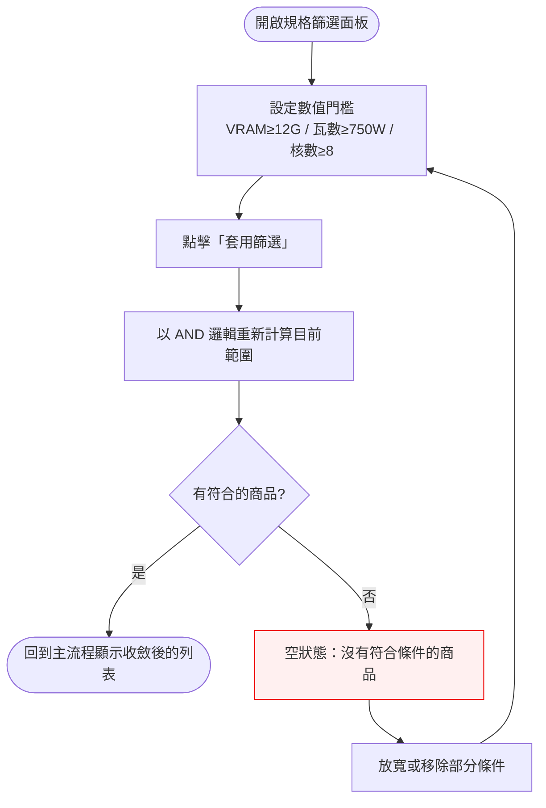

# Interaction Flow：003 - 前端列表與搜尋篩選（frontend-listing-search）

> 功能編號：003 ｜ 功能名稱：frontend-listing-search ｜ 狀態：設計完成
> 建立日期：2026-08-15
> 上游依據：`docs/tech-decisions/tech-decision-原價屋商品價格追蹤-2026-08-15.md`（§3 最終方案、§3.4 資料模型）

---

## 1. 功能概述

提供公開訪客在 GitHub Pages 靜態網站上快速查詢原價屋約 1,449 個追蹤商品的入口：透過「9 大分類瀏覽、全文搜尋、結構化規格篩選」三種方式收斂範圍，並以商品列表（名稱、規格 chips、目前價、昨日漲跌、sparkline 迷你趨勢）一眼掌握價格動態。

**核心價值**：不需登入、不需理解後端，任何人進入網站後 30 秒內找到並比較目標商品的目前價格與昨日漲跌。

---

## 2. 使用者與場景

| 項目 | 內容 |
|------|------|
| **使用者角色** | 一般訪客（公開網站，無需註冊／登入） |
| **觸發入口** | 直接開啟 GitHub Pages 網址（首頁）；或透過分享連結直達分類頁（deep link） |
| **前置條件** | 網站已部署且同 origin 的 `data/items.json` 存在（約 1,449 筆）；瀏覽器支援現代 JavaScript（Vue 3 相容） |
| **使用情境** | ① 隨手逛逛想買電腦零件，瀏覽分類 ② 知道目標型號（如 RTX 4070）直接搜尋 ③ 對規格有硬性需求（VRAM≥12G、瓦數≥750W、CPU 核數≥8）用結構化篩選 ④ 每日查看昨日漲跌決定出手時機 |
| **非目標** | 本功能**不含**：商品詳情頁與歷史趨勢圖（004）、追蹤清單（005）、同類比價（006）。商品卡片保留這些功能的入口位置，但不屬本功能驗收範圍 |

---

## 3. 操作流程圖

### 主流程

### 子流程：規格篩選

---

## 4. 逐步互動說明

### 步驟 1：進入首頁

| | 描述 |
|---|------|
| **觸發** | 訪客於瀏覽器開啟網站網址（GitHub Pages 首頁） |
| **操作前** | 訪客尚未載入任何頁面；瀏覽器可連上 GitHub Pages |
| **系統回應** | 顯示全頁載入狀態（skeleton 骨架），同時下載並解析同 origin 的 `data/items.json` |
| **操作後** | 首頁顯示完成：左側 9 大分類側欄 + 全部商品列表（約 1,449 筆） |
| **下一步** | 步驟 2：選擇分類；或步驟 3：搜尋；或步驟 4：篩選 |

### 步驟 2：從分類側欄選擇分類

| | 描述 |
|---|------|
| **觸發** | 訪客點擊左側側欄任一分類（如「顯示卡」） |
| **操作前** | 位於首頁，列表顯示全部商品 |
| **系統回應** | 頁面 URL 更新為分類參數（`?category=<key>`）；列表重新計算僅保留該分類商品；側欄反白所選分類 |
| **操作後** | 列表顯示該分類商品；分類側欄高亮目前所在分類 |
| **下一步** | 步驟 5：瀏覽列表；或回到本步驟換分類；或步驟 3／4 再收斂 |

### 步驟 3：使用全文搜尋

| | 描述 |
|---|------|
| **觸發** | 訪客在搜尋框輸入關鍵字（如「RTX 4070」） |
| **操作前** | 位於首頁或任一分類頁，列表為目前範圍 |
| **系統回應** | 輸入停止後（約 300ms debounce）即時對「商品名稱 + 結構化規格欄位」做不區分大小寫的子字串比對；列表即時更新 |
| **操作後** | 列表僅顯示關鍵字命中的商品；命中數量顯示於列表標題；搜尋框保留目前關鍵字 |
| **下一步** | 步驟 5：瀏覽結果；若無結果 → 空狀態（見異常處理 #4） |

### 步驟 4：套用結構化規格篩選

| | 描述 |
|---|------|
| **觸發** | 訪客展開「規格篩選」面板，設定至少一個數值門檻（如 VRAM≥12G、瓦數≥750W、CPU 核數≥8），點擊「套用」 |
| **操作前** | 列表目前為「全部商品」或某分類或搜尋結果 |
| **系統回應** | 以 AND 邏輯將目前範圍再收斂；無對應規格欄位的商品不命中；已套用條件顯示為可移除的 chips |
| **操作後** | 列表僅顯示同時滿足所有篩選門檻的商品；篩選面板顯示已套用條件 |
| **下一步** | 步驟 5：瀏覽結果；無結果 → 空狀態（異常處理 #5）；或步驟 6：清除／調整 |

### 步驟 5：瀏覽商品列表

| | 描述 |
|---|------|
| **觸發** | 訪客滾動或檢視商品卡片 |
| **操作前** | 列表已依分類／搜尋／篩選收斂，且至少一筆結果 |
| **系統回應** | 每張卡片渲染：商品名稱、規格 chips（如「14核／20緒／125W」）、目前價、昨日漲跌（漲紅／跌綠／持平灰，無昨日價顯示「—」）、sparkline 迷你趨勢 |
| **操作後** | 訪客可一眼比較價格與漲跌；卡片為後續功能（詳情／追蹤／比價）的入口 |
| **下一步** | 結束瀏覽；或回到步驟 2／3／4 調整條件 |

### 步驟 6：清除搜尋與篩選

| | 描述 |
|---|------|
| **觸發** | 訪客點擊「清除全部條件」按鈕（或單獨移除任一條件 chip） |
| **操作前** | 列表受搜尋關鍵字與／或篩選條件限制 |
| **系統回應** | 搜尋框清空、篩選條件 chips 移除、列表回到目前分類下的完整集合 |
| **操作後** | 列表顯示目前分類（或全部）的完整商品；條件指示消失 |
| **下一步** | 步驟 2／3／4 重新設定；或離開 |

### 步驟 7：直接以分類頁網址進入（deep link）

| | 描述 |
|---|------|
| **觸發** | 訪客透過分享連結直接開啟分類頁 URL（含 `?category=<key>`） |
| **操作前** | 瀏覽器尚無任何頁面狀態 |
| **系統回應** | 載入 `data/items.json` 後依 URL 分類參數直接呈現對應分類頁 |
| **操作後** | 側欄反白對應分類；列表顯示該分類商品 |
| **下一步** | 步驟 3／4：搜尋或篩選 |

---

## 5. 異常處理

| # | 異常情境 | 觸發 | 使用者看到的回饋 | 系統行為 | 恢復路徑 |
|---|----------|------|-------------------|----------|----------|
| 1 | **items.json 載入失敗** | 網路斷線／GitHub Pages 回 404／檔案暫時不可得 | 列表區顯示錯誤狀態：圖示 +「資料載入失敗」+「重試」按鈕 | 不崩潰；保留側欄與搜尋框 UI | 點「重試」重新下載 |
| 2 | **JSON 格式錯誤** | 檔案被截斷或解析失敗 | 同上錯誤狀態，提示「資料格式錯誤」 | 中止解析，避免白畫面 | 點「重試」；或等待下次部署修正 |
| 3 | **資料過期** | `meta.crawled_at` 距今超過 7 天（>7 天，與 007 新鮮度規則共用） | 頁面頂部黃色橫幅「資料可能已過期（最後更新：X）」 | 仍正常顯示資料，僅標示新鮮度 | 無需操作，僅資訊提示 |
| 4 | **搜尋無結果** | 關鍵字無任何名稱／規格命中 | 空狀態：「沒有符合『關鍵字』的商品」+「清除搜尋」按鈕 | 列表清空，顯示空狀態組件 | 點「清除搜尋」或修改關鍵字 |
| 5 | **篩選組合無結果** | 條件過嚴（如 VRAM≥24G 且瓦數≥1200W） | 空狀態：「沒有符合條件的商品」+ 列出已套用條件 +「清除篩選」按鈕 | 同上 | 放寬或移除部分條件 |
| 6 | **商品缺少昨日價** | 商品為新品或 history 僅一筆 | 該卡片漲跌欄顯示「—」而非紅／綠數字 | 正常渲染其餘欄位 | 無需處理 |
| 7 | **商品缺少規格欄位** | spec_parser 未解析出結構化規格 | 該商品仍顯示於「全部／分類／名稱搜尋」結果，但不會命中結構化篩選 | 篩選時靜默排除 | 無需處理（屬資料品質） |
| 8 | **空分類** | 某分類當日 0 筆商品（爬蟲異常） | 該分類點入顯示空狀態 | 不報錯 | 等待下次爬蟲；或管理者介入 |

---

## 6. 邊界與限制

| 面向 | 限制 | 說明 |
|------|------|------|
| **權限** | 無帳號、無登入 | 所有人同權限；不做個人化 |
| **資料規模** | 全量載入 `data/items.json`（約 1,449 筆） | 單次請求；compact arrays 控制體積；不實作伺服器端分頁 |
| **搜尋範圍** | 商品名稱 + 結構化規格欄位（brand/model/cores/vram/wattage 等） | 不含 flags、status、歷史價格 |
| **搜尋比對** | 不區分大小寫的子字串比對 | 不做模糊／斷詞（可列 P2） |
| **篩選語意** | 數值門檻一律「≥（大於等於）」 | 例：VRAM≥12G 包含 12G 與 16G；不支援反向或範圍不等式 |
| **篩選可用性** | 僅對有對應 spec 欄位的商品生效 | 缺欄位商品不命中，UI 不特別標示 |
| **篩選組合** | 多條件一律 AND | 不支援 OR 群組（可列 P2） |
| **分類** | 固定 9 大類（CPU／主機板／記憶體／顯示卡／SSD／HDD／套裝/準系統／劈發價組合區／記憶卡） | 與爬蟲 categories.py 同步；分類頁 URL 帶 `?category=<key>` |
| **URL** | 首頁 `/`、分類頁 `?category=<key>` | 支援 deep link；搜尋與篩選狀態不寫入 URL（可列 P2） |
| **快取** | GitHub Pages 可能快取 items.json | 資料更新後以 `items.v{n}.json` cache-busting |
| **效能** | 首次下載 items.json 後於 client 端即時過濾 | 1,449 筆全量渲染可接受；超過 2,000 筆考慮虛擬列表 |
| **時區** | 資料日期為 UTC，顯示轉台北時間 | 漲跌以「昨日」為基準 |
| **瀏覽器** | 現代瀏覽器（Vue 3 相容） | 不支援 IE |

---

## 7. 驗收檢查清單

- [ ] 首頁載入後顯示左側 9 大分類側欄（CPU／主機板／記憶體／顯示卡／SSD／HDD／套裝/準系統／劈發價組合區／記憶卡）
- [ ] 首頁預設顯示全部商品列表（約 1,449 筆），列表標題顯示總筆數
- [ ] 點擊任一分類後，列表僅顯示該分類商品，且側欄高亮目前所在分類
- [ ] 點擊分類後頁面 URL 反映分類參數（如 `?category=GPU`）
- [ ] 輸入關鍵字後列表即時過濾（搜尋範圍為名稱 + 規格欄位，不區分大小寫）
- [ ] 規格篩選面板可設定 VRAM≥、瓦數≥、CPU 核數≥ 等數值門檻
- [ ] 多個篩選條件同時套用時為 AND 關係
- [ ] 搜尋與篩選可同時作用（交集收斂）
- [ ] 每張商品卡片顯示：名稱、規格 chips、目前價、昨日漲跌、sparkline 迷你趨勢
- [ ] 有昨日價時，漲跌以紅（漲）／綠（跌）／灰（持平）標示；無昨日價顯示「—」
- [ ] 無結果時顯示空狀態與「清除搜尋／篩選」按鈕
- [ ] 「清除全部條件」可一次清空搜尋與篩選，回到目前分類的完整列表
- [ ] `data/items.json` 載入失敗或格式錯誤時顯示錯誤狀態與「重試」按鈕，且頁面不白屏
- [ ] 資料過期超過 7 天顯示「資料可能已過期」提示橫幅（與 007 新鮮度規則一致）
- [ ] 直接開啟分類頁 URL（deep link）可正確載入該分類並反白側欄
- [ ] 套用結構化篩選時，無對應規格欄位的商品被靜默排除、不報錯
- [ ] 於 Chrome、Safari、Edge 最新版可正常瀏覽與操作
