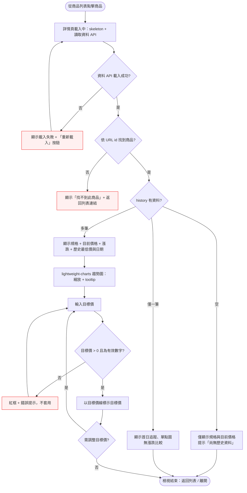

# Interaction Flow：004-product-detail-price-chart（商品詳情與歷史趨勢圖）

> 上游輸入：`docs/tech-decisions/tech-decision-原價屋商品價格追蹤-2026-08-15.md`（§3 技術棧 / §3.4 資料模型）
> 產出日期：2026-08-15

---

## 1. 功能概述

一句話描述：**訪客從商品列表點進任一商品的詳情頁，查看完整規格、目前價格與漲跌、歷史最低價，並在 lightweight-charts 歷史趨勢圖上設定目標價線，輔助購買決策。**

核心價值：把「原價屋商品價格歷史」以視覺化方式呈現，讓訪客不須自行記錄或比價，一眼判斷目前價格是否值得下手。

---

## 2. 使用者與場景

| 項目 | 內容 |
|------|------|
| **角色** | 一般訪客（公開網站，無需註冊／登入） |
| **觸發入口** | ① 商品列表頁／搜尋結果中點擊任一商品列（主路徑）② URL 直接進入（deep link，如 `/#/product/3f9a1c2b8e4d5f6a`） |
| **前置條件** | ① 同 origin 的資料 API（契約 v2：`api/index.json`（categories[]）＋ `api/items/{g}.json` 分類檔；完整歷史另由 `api/trends/{id}.json` 提供）已可存取 ② 該商品存在於載入資料（分類檔每筆 history ≤2 點；趨勢圖/歷史最低價使用 trends 完整歷史） ③ 訪客瀏覽器支援 JavaScript（圖表以 lightweight-charts 渲染） |
| **使用情境** | 訪客在分類頁（如 CPU）看到 i5-13600K 目前價格，點入詳情確認規格完整性、過去價格走勢、歷史最低點，並輸入自己的目標價（如 9,500 元）確認目前價格與目標的差距 |

---

## 3. 操作流程圖

> 註：主路徑（列表點入 → 完整資訊 → 趨勢圖 → 目標價線）約 12 節點，資料不足與錯誤分支向左右展開，可獨立閱讀。

---

## 4. 逐步互動說明

### 步驟 1：進入商品詳情頁

| | 描述 |
|---|------|
| **觸發** | 訪客在商品列表頁／搜尋結果點擊任一商品列（整列可點） |
| **操作前** | 訪客位於列表頁，資料 API 已載入並渲染列表 |
| **系統回應** | 路由切換至詳情頁，URL 帶入該商品 id（如 `#/product/3f9a1c2b8e4d5f6a`）；頁面顯示載入中狀態（skeleton／spinner），背景讀取同 origin 的資料 API（`api/index.json`（categories[]）→ `loadAll` 聚合 `api/items/{g}.json?v={crawled_at}` 供商品定位），並依商品 id fetch `api/trends/{id}.json` 載入完整歷史 |
| **操作後** | 詳情頁呈現「載入中」，列表頁保留於瀏覽歷史（可返回） |
| **下一步** | 步驟 2：等待資料載入與商品定位 |

### 步驟 2：資料載入與商品定位

| | 描述 |
|---|------|
| **觸發** | 自動（步驟 1 的背景 fetch 完成） |
| **操作前** | 詳情頁顯示載入中 |
| **系統回應** | 列表快照 fetch 成功 → 依 URL 中的 id 於 items 陣列定位商品（name / spec / status / 短 history…）；同時 `useTrend` 以 id 載入 `api/trends/{id}.json` 完整歷史（失敗僅趨勢區塊降級，不影響商品定位與其餘頁面）；找不到 → 切換錯誤畫面 |
| **操作後** | 商品資料就緒，頁面開始依資料渲染（或進入錯誤分支） |
| **下一步** | 步驟 3：渲染規格與價格資訊 |

### 步驟 3：顯示規格與價格資訊

| | 描述 |
|---|------|
| **觸發** | 商品物件就緒後自動渲染 |
| **操作前** | 商品資料已取得，頁面尚未顯示內容 |
| **系統回應** | ① 完整渲染 `spec` 物件的每個欄位（「欄位名：值」形式，如 品牌：Intel、型號：i5-13600K、核心：14、執行緒：20…）；② 顯示目前價格（列表快照 history 最後一筆的 p）；③ 與前一筆價格比較顯示漲跌（降價綠色 ▼／漲價紅色 ▲／持平灰色 —，含金額與百分比）；④ 顯示歷史最低價與達成日期（以 api/trends 完整歷史計算；trends 未就緒時退回短歷史） |
| **操作後** | 資訊區渲染完成，訪客可閱讀規格與價格摘要 |
| **下一步** | 步驟 4：渲染歷史價格趨勢圖 |

### 步驟 4：渲染歷史價格趨勢圖

| | 描述 |
|---|------|
| **觸發** | 步驟 3 完成後自動初始化 |
| **操作前** | 資訊區已顯示；trends 完整歷史需有 ≥1 筆資料（useTrend 已載入） |
| **系統回應** | 以 lightweight-charts 將 `api/trends/{id}.json` 的完整 `[d, p]` 時間序列渲染為折線圖：X 軸為日期、Y 軸為價格；支援內建縮放／平移與自寫 tooltip（懸停顯示日期與價格）；歷史僅一筆時顯示單點圖；trends 載入失敗 → 趨勢區塊顯示錯誤或僅用列表 ≤2 點短歷史繪製，其餘頁面照常 |
| **操作後** | 趨勢圖可互動（拖曳縮放、懸停查價）；訪客可觀察價格走勢與歷史低點 |
| **下一步** | 步驟 5：輸入目標價格 |

### 步驟 5：輸入目標價格

| | 描述 |
|---|------|
| **觸發** | 訪客於「目標價」輸入框輸入數字（含小數） |
| **操作前** | 趨勢圖已顯示；輸入框為空 |
| **系統回應** | 輸入即時驗證：必須為有效數字且 > 0；無效（非數字、≤0、空白）→ 輸入框紅框並顯示錯誤提示，不套用；有效 → 輸入框正常顯示 |
| **操作後** | 輸入框持有有效數值（或顯示錯誤提示等待修正） |
| **下一步** | 步驟 6：套用目標價線 |

### 步驟 6：套用目標價線

| | 描述 |
|---|------|
| **觸發** | 訪客點擊「設定目標價」按鈕（或於輸入框按下 Enter） |
| **操作前** | 輸入框內為有效目標價 |
| **系統回應** | lightweight-charts 於對應 Y 值繪製橫向目標價線（`createPriceLine`，價格軸 title「目標價」）；tooltip 同步標註目標價 |
| **操作後** | 圖上出現目標價線；訪客可修改輸入重新套用、點擊「清除」移除線，或返回列表／離開 |
| **下一步** | 結束（或回到步驟 5 調整目標價） |

---

## 5. 異常處理

| 情境 | 使用者看到的回饋 | 恢復路徑 |
|------|-----------------|----------|
| 資料 API 載入失敗（網路斷線／伺服器錯誤／CORS 異常） | 全頁錯誤畫面：「資料載入失敗」+「重新載入」按鈕 | 點擊「重新載入」重新 fetch；持續失敗則停留在錯誤畫面，可返回列表 |
| URL 中的商品 id 不存在（deep link 失效／id 格式錯誤） | 「找不到此商品」+「返回列表」連結 | 點擊返回列表重新選取商品 |
| 商品存在但 `history` 為空陣列 | 僅顯示規格與目前價格；隱藏趨勢圖、漲跌、歷史最低；顯示提示「尚無歷史資料」 | 無需恢復；等待後續爬蟲累積資料 |
| `history` 僅一筆（首日追蹤） | 顯示「首日追蹤，尚無漲跌比較」；歷史最低＝目前價格；趨勢圖僅單點 | 無需恢復；隔日爬蟲後自動補齊 |
| 目標價輸入無效（非數字／≤0／空白） | 輸入框紅框 + 提示（非數字：「請輸入有效數字」；≤0：「請輸入大於 0 的有效數字」；空白：「請輸入目標價」），不套用目標價線 | 修正輸入後重新套用 |
| 目標價超出歷史價格區間 | 仍套用目標價線；提示「目標價超出歷史區間」，圖表自動擴展 Y 軸範圍以顯示該線 | 可調整目標價或清除 |
| `api/trends/{id}.json` 載入失敗（404／網路／格式） | 僅趨勢圖區塊顯示錯誤或退回短歷史；規格／目前價／漲跌／歷史最低（短歷史）／目標價皆照常，不影響其餘頁面 | 重新載入（useTrend.retry）或忽略；待下一次 daily 組裝後自動恢復 |

---

## 6. 邊界與限制

| 項目 | 限制說明 |
|------|----------|
| **資料來源** | 僅讀取同 origin 的資料 API（契約 v2：`api/index.json`（categories[]）＋ `api/items/{g}.json?v={crawled_at}` 分類檔 ＋ `api/trends/{id}.json`，靜態檔案），無後端 API、無即時請求 |
| **資料新鮮度** | 資料由 GitHub Actions 每日爬蟲更新（約台北 14:00），詳情頁顯示 meta.crawled_at 對應的最後更新時間；可能與原價屋現場價格有時間差 |
| **歷史取樣** | 歷史採「每日一點累積」策略：每次成功爬取（含平價日）寫入每日價格點檔，跨日連續每日有值；失敗未爬取日如實留白不補點。完整歷史由 `data/daily/`（真相）→ `api/trends/{id}.json`（對外）承載；列表快照僅最近 ≤2 點 |
| **追蹤範圍** | 僅涵蓋 9 個分類約 1,449 個商品；不在範圍內的商品無資料 |
| **目標價持久化** | 目標價僅本次瀏覽有效（session），未與「追蹤清單／Telegram 通知」整合前不寫入任何儲存；重新進入詳情頁需重新輸入 |
| **互動範圍** | 縮放／平移、tooltip、目標價線僅為圖表層互動，不改變資料與其他頁面 |
| **商品下架** | 商品 status 為 gone（不再出現於當日清單）時，詳情頁仍顯示既有歷史並提示「此商品已下架」 |
| **權限** | 全站公開、無登入；所有訪客權限一致，無寫入端功能 |
| **標記語意** | 原價屋頁面標記（Hot！／任搭↓N／尾盤）語意尚待觀察驗證，詳情頁不詮釋此類標記 |

---

## 7. 驗收檢查清單

- [ ] 從商品列表／搜尋結果點擊任一商品，可進入對應詳情頁，且 URL 含該商品 id
- [ ] 詳情頁載入期間顯示載入狀態（skeleton／spinner）
- [ ] 資料 API 載入失敗時顯示「資料載入失敗」+「重新載入」按鈕；重試成功後可恢復顯示
- [ ] 以無效商品 id 直接進入時顯示「找不到此商品」與返回列表連結
- [ ] 規格區以「欄位名：值」形式顯示 spec 物件的全部欄位（不含空值欄位）
- [ ] 顯示目前價格（history 最後一筆的 p）
- [ ] 有前一筆價格時顯示漲跌：降價（綠色 ▼）、漲價（紅色 ▲）、持平（灰色 —），含金額與百分比
- [ ] 顯示歷史最低價與達成日期；同日多筆最低時取最早日期
- [ ] history 為空時：隱藏趨勢圖與漲跌比較，顯示「尚無歷史資料」
- [ ] history 僅一筆時：顯示「首日追蹤，尚無漲跌比較」、歷史最低＝目前價格、趨勢圖為單點圖
- [ ] lightweight-charts 趨勢圖正確渲染 `api/trends/{id}.json` 的完整 `[d, p]` 時間序列（X=日期、Y=價格）
- [ ] 趨勢資料（`api/trends/{id}.json`）載入失敗時僅趨勢區塊降級，其餘頁面（規格/價格/目標價）照常
- [ ] 趨勢圖支援縮放／平移與 tooltip（懸停顯示日期與價格）
- [ ] 輸入有效目標價並套用後，趨勢圖出現目標價線（價格軸 title「目標價」）
- [ ] 無效目標價（非數字／≤0／空白）無法套用，輸入框紅框並顯示提示
- [ ] 目標價超出歷史區間時仍可套用，且圖表擴展 Y 軸顯示該線並提示
- [ ] 目標價可修改（目標價線同步更新）與清除（目標價線消失）
- [ ] 顯示資料 crawled_at 對應的最後更新時間（台北時區）
- [ ] 商品 status 為 gone 時顯示「此商品已下架」提示，且既有歷史仍可檢視
