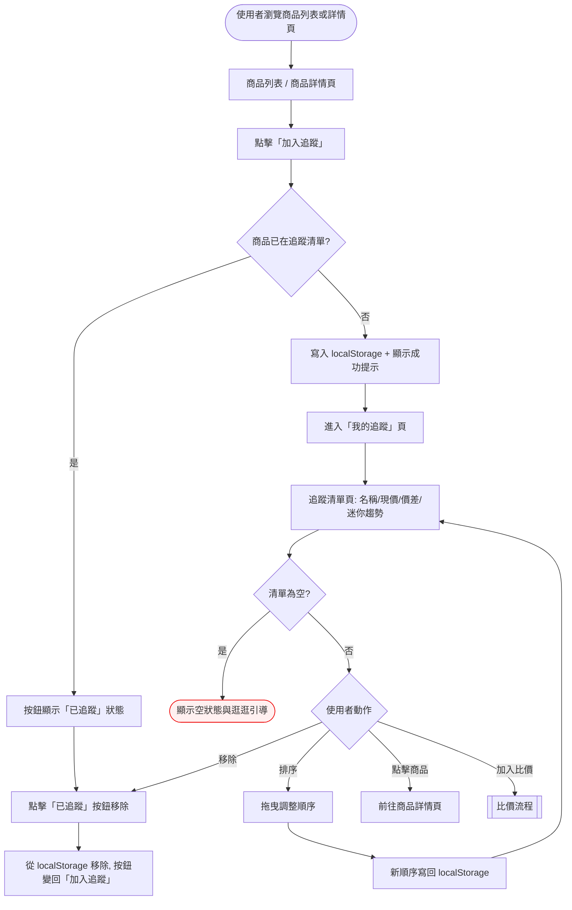
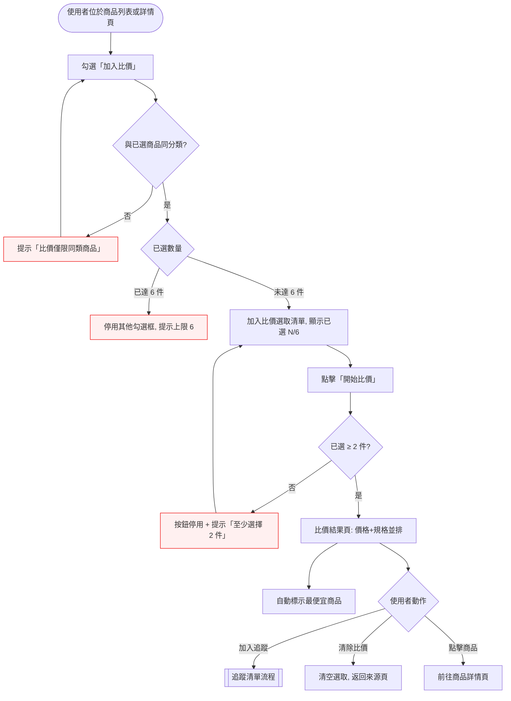

# Interaction Flow：005 - 追蹤清單與比價（watchlist-and-compare）

> 上游文件：`docs/tech-decisions/tech-decision-原價屋商品價格追蹤-2026-08-15.md`（§3.4 資料模型、§4.1 P1 任務）
> 對應功能：① 追蹤清單（localStorage）② 同類商品比價（多選比較表）

---

## 1. 功能概述

**一句話描述**：讓訪客免註冊、免後端，在本機瀏覽器（localStorage）維護自己的商品追蹤清單，並將最多 6 件同類商品並排比較價格與規格、自動標示最便宜。

**核心價值**：在「公開網站、無帳號、純靜態站」的限制下，提供個人化的價格持續追蹤與購買前的最終比價決策支援。

**關鍵定義（後續 BDD 可追溯）**：

| 名詞 | 定義 |
|------|------|
| 追蹤清單 | 儲存於瀏覽器 `localStorage`（key：`coolpc.watchlist`）的商品 ID 陣列，含加入時間與價格快照 |
| 價差 | 目前價格 − 上次查看時記錄的價格快照（每次開啟追蹤清單頁時更新快照） |
| 迷你趨勢 | 商品最近 7 日歷史價格的 sparkline（來源：載入資料的 history） |
| 比價選取清單 | 本次比價勾選的商品集合，存於 `sessionStorage`，關閉分頁即清空 |
| 同分類 | 商品主分類（CPU / 主機板 / 記憶體 / 顯示卡 / SSD / HDD / 套裝/準系統 / 劈發價組合區 / 記憶卡）相同 |

---

## 2. 使用者與場景

| 項目 | 內容 |
|------|------|
| **角色** | 一般訪客（公開網站，無需註冊 / 登入） |
| **觸發入口** | ① 商品列表頁（分類頁 / 搜尋結果）每列的「加入追蹤」按鈕與「加入比價」勾選框 ② 商品詳情頁的「加入追蹤」按鈕與「加入比價」按鈕 ③ 導覽列「我的追蹤」 ④ 比價結果頁的「加入追蹤」/「清除比價」 |
| **前置條件** | 無（開放所有人）；瀏覽器需支援並允許 `localStorage`（追蹤）與 `sessionStorage`（比價） |
| **使用情境** | ① 訪客逛分類/搜尋時看到有興趣的商品 → 加入追蹤，之後回來看價格有沒有掉 ② 訪客追蹤多張顯卡 → 用追蹤清單頁比較價差與迷你趨勢 ③ 訪客準備購買 → 勾選 2~6 件同類商品產出比較表，找出最便宜 |

---

## 3. 操作流程圖

### 主流程 A：追蹤清單管理

### 主流程 B：比價

---

## 4. 逐步互動說明

### 主流程 A：追蹤清單管理

#### 步驟 A1：瀏覽商品

| | 描述 |
|---|------|
| **觸發** | 使用者透過分類頁、搜尋結果或直接輸入 URL 進入商品列表 / 商品詳情頁 |
| **操作前** | 商品資料（資料 API）已載入完成，頁面顯示商品清單 |
| **系統回應** | 每個商品列顯示「加入追蹤」按鈕；詳情頁顯示「加入追蹤」按鈕；已追蹤商品按鈕改顯示「已追蹤」 |
| **操作後** | 使用者停留在原頁面，可繼續瀏覽或操作 |
| **下一步** | 步驟 A2：加入追蹤 |

#### 步驟 A2：加入追蹤

| | 描述 |
|---|------|
| **觸發** | 使用者點擊某商品的「加入追蹤」按鈕 |
| **操作前** | 該商品尚未在追蹤清單中，按鈕顯示「加入追蹤」 |
| **系統回應** | 將商品 ID 與加入時間、當下價格快照寫入 `localStorage`；按鈕變為「已追蹤」；顯示「已加入追蹤」提示 |
| **操作後** | 商品加入追蹤清單；刷新頁面後追蹤狀態仍保留 |
| **下一步** | 步驟 A5：前往「我的追蹤」檢視 |

#### 步驟 A3：重複加入（已在清單中）

| | 描述 |
|---|------|
| **觸發** | 使用者對已在追蹤清單的商品再點一次按鈕 |
| **操作前** | 商品已在追蹤清單，按鈕顯示「已追蹤」 |
| **系統回應** | 不會重複寫入；按鈕維持「已追蹤」；提示「該商品已在追蹤清單」 |
| **操作後** | 追蹤清單內容不變（不產生重複項目） |
| **下一步** | 步驟 A4：移除追蹤（點擊「已追蹤」按鈕即為移除） |

#### 步驟 A4：移除追蹤

| | 描述 |
|---|------|
| **觸發** | 使用者點擊「已追蹤」按鈕（列表/詳情/追蹤清單頁皆可） |
| **操作前** | 商品存在於追蹤清單 |
| **系統回應** | 從 `localStorage` 移除該商品；按鈕變回「加入追蹤」；若在追蹤清單頁則該列移除、剩餘商品維持原順序 |
| **操作後** | 商品不再出現於追蹤清單；刷新頁面後仍為移除狀態 |
| **下一步** | 步驟 A5（若清單變空 → 步驟 A7 空狀態） |

#### 步驟 A5：檢視追蹤清單

| | 描述 |
|---|------|
| **觸發** | 使用者點擊導覽列「我的追蹤」 |
| **操作前** | 追蹤清單有至少 1 件商品 |
| **系統回應** | 依排序顯示每件商品：名稱、目前價格、價差（現價 − 上次查看快照價，漲價紅 / 跌價綠）、迷你趨勢（最近 7 日 sparkline）；同時以目前價格更新「上次查看快照」 |
| **操作後** | 使用者看到最新的價格與價差資訊；下次開啟時以此為價差基準 |
| **下一步** | 步驟 A4 移除 / 步驟 A6 排序 / 點擊商品進詳情 / 加入比價 |

#### 步驟 A6：排序追蹤清單

| | 描述 |
|---|------|
| **觸發** | 使用者拖曳追蹤清單中的商品列調整順序 |
| **操作前** | 追蹤清單有至少 2 件商品 |
| **系統回應** | 列表即時以新順序呈現；新順序寫回 `localStorage` |
| **操作後** | 刷新頁面後順序維持新排序 |
| **下一步** | 回到步驟 A5 檢視清單 |

#### 步驟 A7：空追蹤清單

| | 描述 |
|---|------|
| **觸發** | 使用者進入「我的追蹤」頁且清單為空（尚未加入或全部移除） |
| **操作前** | `localStorage` 中無任何追蹤商品 |
| **系統回應** | 顯示空狀態說明與「去逛逛」引導按鈕，不顯示任何商品列 |
| **操作後** | 使用者被引導回分類頁瀏覽 |
| **下一步** | 步驟 A1：重新瀏覽商品 |

---

### 主流程 B：比價

#### 步驟 B1：勾選商品加入比價

| | 描述 |
|---|------|
| **觸發** | 使用者在商品列表頁勾選「加入比價」勾選框，或在詳情頁點擊「加入比價」 |
| **操作前** | 比價選取清單目前少於 6 件 |
| **系統回應** | 商品加入比價選取清單（`sessionStorage`）；顯示已選 N/6 的計數 |
| **操作後** | 勾選框保持勾選狀態；跨頁面瀏覽仍保留 |
| **下一步** | 步驟 B2 / B4：繼續勾選或開始比價 |

#### 步驟 B2：同分類檢查

| | 描述 |
|---|------|
| **觸發** | 使用者勾選的商品與已選清單主分類不同 |
| **操作前** | 已選清單內已有其他分類的商品 |
| **系統回應** | 拒絕加入；提示「比價僅限同類商品」；新商品勾選框回到未勾選 |
| **操作後** | 比價選取清單不變 |
| **下一步** | 回到步驟 B1 改選同類商品 |

#### 步驟 B3：達到 6 件上限

| | 描述 |
|---|------|
| **觸發** | 已選清單達 6 件後，使用者嘗試勾選第 7 件 |
| **操作前** | 比價選取清單已滿 6 件 |
| **系統回應** | 第 7 件商品無法勾選；提示「最多只能比較 6 件商品」；其他未選商品勾選框停用 |
| **操作後** | 原 6 件選取不受影響 |
| **下一步** | 步驟 B4：開始比價 |

#### 步驟 B4：開始比價

| | 描述 |
|---|------|
| **觸發** | 使用者點擊「開始比價」按鈕 |
| **操作前** | 比價選取清單 ≥ 2 件且 ≤ 6 件，全為同分類 |
| **系統回應** | （選取 < 2 件時按鈕停用並提示「至少選擇 2 件」）選取合法則進入比價結果頁 |
| **操作後** | 使用者位於比價結果頁 |
| **下一步** | 步驟 B5：檢視比較結果 |

#### 步驟 B5：檢視比較表與最便宜標示

| | 描述 |
|---|------|
| **觸發** | 使用者檢視比價結果頁 |
| **操作前** | 已完成 2~6 件同類商品的比價 |
| **系統回應** | 比較表第一欄為規格欄位（價格、品牌、型號、依分類決定的規格 key/value，如 CPU：核心數/執行緒/基礎時脈/超頻時脈/TDP），其餘各欄並排對應商品；價格最低者標示「最便宜」（同價並列標示）；已下架商品標示「已下架」且不列入最便宜計算 |
| **操作後** | 使用者可一眼看出規格差異與最低價 |
| **下一步** | 步驟 B6：加入追蹤 / 清除比價 / 點擊商品 |

#### 步驟 B6：比價結果的操作（加入追蹤 / 清除）

| | 描述 |
|---|------|
| **觸發** | 使用者點擊比價表中的「加入追蹤」，或點擊「清除比價」 |
| **操作前** | 使用者位於比價結果頁 |
| **系統回應** | 「加入追蹤」→ 該商品寫入追蹤清單，按鈕變「已追蹤」；「清除比價」→ 比價選取清單清空、各商品勾選框回到未勾選，返回來源頁 |
| **操作後** | 追蹤清單增加商品；或比價選取清空 |
| **下一步** | 回到列表頁重新選取，或前往「我的追蹤」 |

---

## 5. 異常處理

| # | 異常情境 | 使用者看到的回饋 | 恢復路徑 |
|---|----------|------------------|----------|
| 1 | 瀏覽器不支援 / 封鎖 `localStorage`（隱私模式、停用儲存） | 點「加入追蹤」時提示「瀏覽器未開放本機儲存，無法使用追蹤功能」 | 開啟瀏覽器儲存權限後重新操作；頁面不當機 |
| 2 | `localStorage` 空間已滿，寫入失敗 | 提示「儲存空間已滿，無法新增追蹤項目」 | 移除部分追蹤商品後重試；原有清單不受影響 |
| 3 | 追蹤商品已下架（不再出現在當日商品資料） | 追蹤清單中該商品標示「已下架」，價格欄顯示「—」 | 使用者可手動移除；不自動清除 |
| 4 | 商品資料（資料 API）載入失敗 | 追蹤/比價頁面顯示「資料載入失敗」與「重新載入」按鈕 | 點「重新載入」重試；既有 localStorage 追蹤資料不受影響 |
| 5 | 比價選取少於 2 件就點「開始比價」 | 「開始比價」按鈕停用；提示「請至少選擇 2 件商品進行比價」 | 繼續勾選至 2 件以上 |
| 6 | 比價選取達 6 件後再嘗試勾選 | 無法勾選；提示「最多只能比較 6 件商品」 | 先取消勾選既有商品再選新的 |
| 7 | 勾選跨分類商品（如 CPU + 顯示卡） | 拒絕加入；提示「比價僅限同類商品」 | 只保留同一主分類的選取 |
| 8 | 比價清單中的商品已下架 | 比較表該欄標示「已下架」 | 最便宜標示僅在有價格的商品中計算 |
| 9 | 商品歷史資料不足 2 天 | 迷你趨勢顯示「資料不足」而非圖表 | 等每日爬蟲累積資料後自然恢復 |

---

## 6. 邊界與限制

- **無帳號 / 本機專屬**：追蹤清單僅存於單一瀏覽器的 `localStorage`，不跨裝置、不跨瀏覽器、不雲端同步；清除瀏覽器資料即永久遺失。
- **儲存上限**：`localStorage` 約 5MB；追蹤清單以商品 ID + 快照精簡儲存（每筆 < 1KB），全站 1,449 件全追蹤仍遠低於上限。
- **比價數量**：單次比價最少 2 件、最多 6 件，且僅限同一主分類。
- **比價選取生命週期**：比價選取清單存於 `sessionStorage`，同一分頁內跨頁面瀏覽保留，關閉分頁即清空。
- **資料新鮮度**：價格來自每日一次爬蟲（GitHub Actions，06:00 UTC），非即時價格。
- **迷你趨勢範圍**：僅取最近 7 日歷史價格；歷史不足 2 日時顯示「資料不足」。
- **價差基準**：以「上次開啟追蹤清單頁時的價格快照」為比較基準，首次加入以加入當時價格為基準。
- **排序範圍**：排序順序僅本機有效。
- **規格欄位**：比價表規格欄位依主分類決定（CPU / 顯示卡等深解析分類顯示多欄；記憶卡 / 套裝機輕量分類僅顯示基礎欄位）。

---

## 7. 驗收檢查清單

### 追蹤清單管理

- [ ] 未登入訪客可在商品列表頁將商品加入追蹤，按鈕變為「已追蹤」並顯示成功提示
- [ ] 未登入訪客可在商品詳情頁將商品加入追蹤
- [ ] 已在清單的商品按鈕顯示「已追蹤」，重複點擊不會產生重複項目
- [ ] 點擊「已追蹤」按鈕可移除商品，按鈕變回「加入追蹤」
- [ ] 追蹤清單頁顯示每件商品的：名稱、目前價格、價差、迷你趨勢
- [ ] 價差 = 目前價格 − 上次查看快照價；漲價以漲價樣式、跌價以跌價樣式呈現
- [ ] 開啟追蹤清單頁後，下次價差基準更新為本次價格
- [ ] 迷你趨勢顯示最近 7 日價格；歷史不足 2 日時顯示「資料不足」
- [ ] 拖曳排序後刷新頁面，順序維持
- [ ] 移除全部商品後顯示空狀態與「去逛逛」引導
- [ ] 追蹤清單跨瀏覽器 session（重新整理、關閉再開分頁）仍保留
- [ ] 瀏覽器不支援 localStorage 時提示錯誤且頁面不當機
- [ ] localStorage 空間滿時提示且原有清單不受影響
- [ ] 已下架商品標示「已下架」且價格欄顯示「—」

### 比價

- [ ] 從商品列表頁勾選框或詳情頁按鈕可將商品加入比價，顯示已選 N/6
- [ ] 比價僅限同一主分類；跨分類勾選被拒絕並提示
- [ ] 選取達 6 件後無法再勾選，提示上限
- [ ] 選取少於 2 件時「開始比價」停用並提示
- [ ] 選取 2~6 件同類商品可進入比價結果頁
- [ ] 比較表並排顯示各商品價格與規格欄位（key/value），第一欄為欄位名稱
- [ ] 價格最低的商品自動標示「最便宜」；同價時並列標示
- [ ] 比價表中可將商品加入追蹤
- [ ] 「清除比價」清空選取並回到來源頁
- [ ] 比價選取在同分頁跨頁面瀏覽維持；關閉分頁後清空
- [ ] 比價清單中的已下架商品標示「已下架」，且不列入最便宜計算
