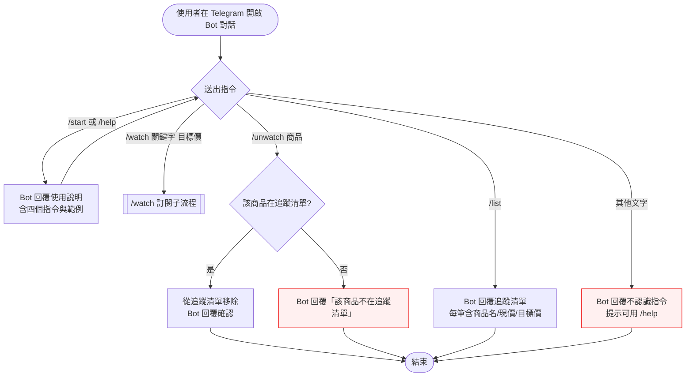
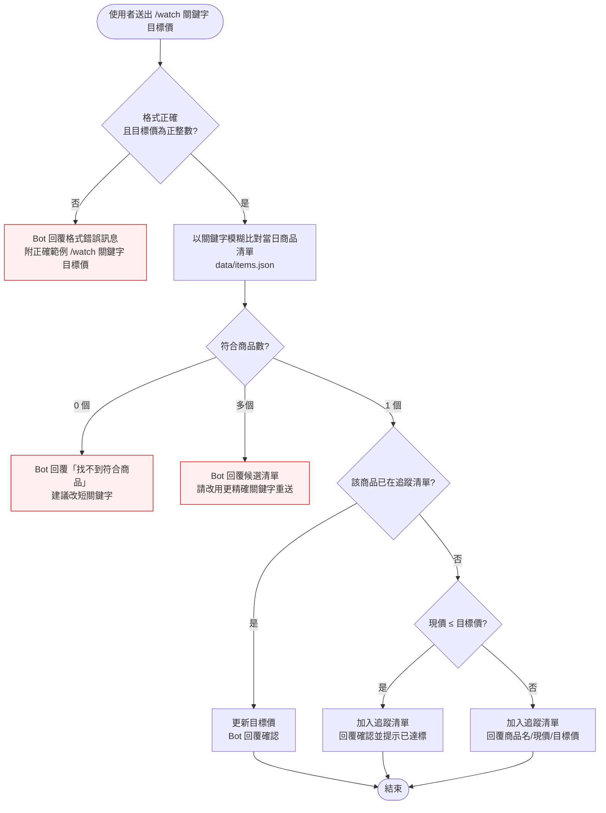
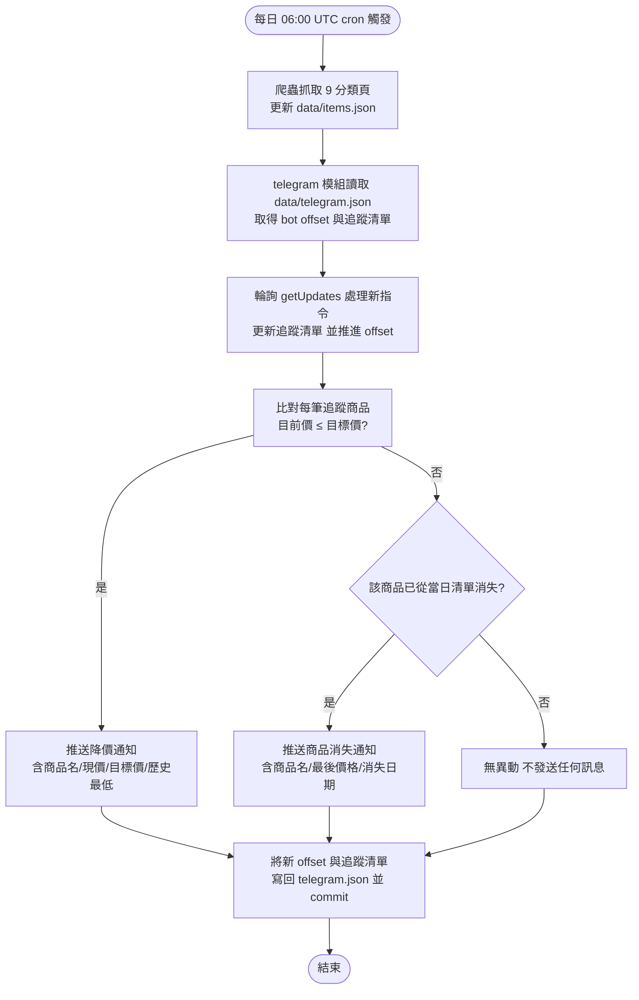

# Interaction Flow：006-telegram-price-alert（Telegram 降價通知）

> 上游輸入：docs/tech-decisions/tech-decision-原價屋商品價格追蹤-2026-08-15.md（§3.2 步驟⑤ telegram、§3.3 data/telegram.json）
> 產出日期：2026-08-15

## 1. 功能概述

一句話：Telegram 使用者透過 Bot 指令訂閱原價屋商品並設定目標價，系統在每日爬蟲執行時自動比對價格，降價（現價 ≤ 目標價）或商品消失時主動推送通知。

核心價值：**免安裝 App、免註冊帳號、免架設伺服器**——只要在 Telegram 按 /start，就能在商品到達理想價格的隔日自動收到通知，不再需要每天手動刷原價屋。

## 2. 使用者與場景

| 項目 | 內容 |
|------|------|
| **角色** | ① Telegram 使用者（公開，無需註冊登入，以 Telegram user id 識別）② 系統自動觸發（GitHub Actions 每日 cron run） |
| **觸發入口** | ① 使用者在 Telegram 搜尋並開啟 Bot 對話、送出指令文字 ② 每日 06:00 UTC（台北 14:00）cron 自動觸發 |
| **前置條件** | Bot token 已設定於 GitHub Actions secrets；data/telegram.json 存在（含 offset 與追蹤清單）；每日爬蟲已完成並更新 data/items.json（9 分類 ≈ 1,449 商品） |
| **使用情境** | 使用者想買某張顯示卡但覺得現價太貴 → 用 /watch 訂閱並設目標價 → 隔日價格跌到目標價以下，Telegram 主動收到通知 → 立即下單；已停售/下架商品也會收到消失通知，避免空等 |

## 3. 操作流程圖

### 3.1 主流程：使用者指令互動（Telegram 對話）

### 3.2 子流程：/watch 訂閱

### 3.3 系統自動觸發：每日執行通知流程

## 4. 逐步互動說明

### 流程 A：Telegram 使用者互動

#### 步驟 A1：開始對話並取得使用說明（/start）

| | 描述 |
|---|------|
| **觸發** | 使用者在 Telegram 搜尋到 Bot 後點「開始」，送出 /start（或之後送出 /help） |
| **操作前** | 使用者已開啟 Telegram 對話，尚未見過任何 Bot 訊息 |
| **系統回應** | Bot 回覆使用說明：四個指令（/watch、/unwatch、/list、/help）與使用範例「/watch RTX 4060 9000」 |
| **操作後** | 使用者知道如何訂閱商品；系統可在 data/telegram.json 建立該使用者的追蹤清單 |
| **下一步** | 步驟 A2：送出 /watch 訂閱第一個商品 |

#### 步驟 A2：/watch 訂閱商品（唯一符合）

| | 描述 |
|---|------|
| **觸發** | 使用者送出「/watch i5-13600K 9000」 |
| **操作前** | 使用者已看過使用說明；當日商品清單已存在（來自最近一次爬蟲） |
| **系統回應** | 解析出關鍵字「i5-13600K」與目標價「9000」→ 模糊比對當日清單，恰有一個商品符合 → Bot 回覆「已加入追蹤：Intel i5-13600K，目前價格 9990 元，目標價 9000 元」 |
| **操作後** | 該商品寫入使用者追蹤清單（含目標價 9000）；data/telegram.json 異動待本次 run 結束 commit |
| **下一步** | 使用者可繼續 /watch 其他商品，或等每日執行收到通知 |

#### 步驟 A3：/watch 多個商品符合

| | 描述 |
|---|------|
| **觸發** | 使用者送出「/watch RTX 4060 8000」，清單中 3 個商品名稱都含「RTX 4060」 |
| **操作前** | 使用者已看過使用說明 |
| **系統回應** | Bot 回覆候選清單（商品名 + 現價），並請使用者改用更精確的關鍵字重送 |
| **操作後** | 不加入任何商品；追蹤清單不變 |
| **下一步** | 使用者改用更精確關鍵字（如完整型號）重送 /watch |

#### 步驟 A4：/watch 找不到商品

| | 描述 |
|---|------|
| **觸發** | 使用者送出「/watch 3080Ti 水冷版 5000」，清單中無任何商品符合 |
| **操作前** | 使用者已看過使用說明 |
| **系統回應** | Bot 回覆「找不到符合商品，請檢查關鍵字或改用較短關鍵字」 |
| **操作後** | 追蹤清單不變 |
| **下一步** | 使用者調整關鍵字重送 /watch |

#### 步驟 A5：/unwatch 取消訂閱

| | 描述 |
|---|------|
| **觸發** | 使用者送出「/unwatch i5-13600K」 |
| **操作前** | 該商品存在於使用者追蹤清單（否則 Bot 回覆「該商品不在追蹤清單」） |
| **系統回應** | Bot 回覆「已移除：Intel i5-13600K」 |
| **操作後** | 該商品從使用者追蹤清單移除，不再收到其通知 |
| **下一步** | 使用者可用 /list 確認剩餘追蹤，或結束 |

#### 步驟 A6：/list 查看追蹤清單

| | 描述 |
|---|------|
| **觸發** | 使用者送出 /list |
| **操作前** | 使用者追蹤清單可能有 0 或多筆商品 |
| **系統回應** | Bot 回覆追蹤清單：每筆含商品名稱、目前價格、目標價；清單為空時回覆「目前沒有追蹤任何商品」並提示用 /watch 加入 |
| **操作後** | 無狀態變化 |
| **下一步** | 使用者可 /unwatch 或調整訂閱 |

#### 步驟 A7：未知指令

| | 描述 |
|---|------|
| **觸發** | 使用者送出「/price」或任意非指令文字 |
| **操作前** | 無特殊條件 |
| **系統回應** | Bot 回覆「不認識這個指令，輸入 /help 查看使用說明」 |
| **操作後** | 無狀態變化 |
| **下一步** | 使用者送出 /help 或正確指令 |

### 流程 B：系統自動觸發（每日執行）

#### 步驟 B1：每日 run 啟動與資料更新

| | 描述 |
|---|------|
| **觸發** | GitHub Actions cron（每日 06:00 UTC = 台北 14:00）自動觸發 |
| **操作前** | 前一天 data/items.json、data/telegram.json 已 commit；token 存於 secrets |
| **系統回應** | 爬蟲抓取 9 個分類頁 → 解析 → 與昨日 diff → 更新 data/items.json（商品價格、status=gone、history append） |
| **操作後** | items.json 反映當日最新價格與商品存在狀態 |
| **下一步** | 步驟 B2：telegram 模組開始 |

#### 步驟 B2：輪詢 getUpdates 處理指令

| | 描述 |
|---|------|
| **觸發** | telegram 模組讀取 data/telegram.json 的 offset 後呼叫 Bot API getUpdates |
| **操作前** | offset 為上次處理位置；可能有使用者在上次 run 後送出指令 |
| **系統回應** | 取得 offset 之後的新訊息 → 逐筆執行 /start、/watch、/unwatch、/list、/help → 回覆使用者 → 更新追蹤清單 |
| **操作後** | 追蹤清單反映最新訂閱狀態；offset 推進至最後一筆 update id |
| **下一步** | 步驟 B3：比對價格並推送通知 |

#### 步驟 B3：比對價格推送降價通知

| | 描述 |
|---|------|
| **觸發** | 針對使用者追蹤清單中的每個商品，讀取當日價格與歷史最低價 |
| **操作前** | 追蹤清單可能有 0 或多筆商品 |
| **系統回應** | 當 目前價格 ≤ 目標價 時，向該使用者推送降價通知，內容含：商品名稱、目前價格、目標價、歷史最低價 |
| **操作後** | 使用者收到通知；若價格未達標則不發送 |
| **下一步** | 步驟 B4：檢查商品消失 |

#### 步驟 B4：推送商品消失通知

| | 描述 |
|---|------|
| **觸發** | 追蹤商品在當日清單中已不存在（status=gone） |
| **操作前** | 商品上一次存在於某日清單，本次消失 |
| **系統回應** | Bot 向追蹤該商品的使用者推送消失通知，內容含：商品名稱、最後價格、消失日期 |
| **操作後** | 使用者知道該商品已停售/下架，可自行 /unwatch |
| **下一步** | 步驟 B5：寫回狀態並結束 |

#### 步驟 B5：寫回 telegram.json 並 commit

| | 描述 |
|---|------|
| **觸發** | 所有指令與通知處理完畢 |
| **操作前** | offset 與追蹤清單仍為本次執行前的狀態 |
| **系統回應** | 將新 offset 與追蹤清單寫回 data/telegram.json，與 items.json 一併 commit 至 repo（下次 run 由此繼續） |
| **操作後** | data/telegram.json 為最新狀態；本次 run 結束 |
| **下一步** | 下一次每日執行自動開始 |

## 5. 異常處理

| 異常情境 | 使用者看到的回饋 / 系統行為 | 恢復路徑 |
|----------|------------------------------|----------|
| /watch 格式錯誤（缺目標價、目標價非正整數、關鍵字為空） | Bot 回覆格式錯誤訊息，附正確範例「/watch 關鍵字 目標價」；不加入追蹤 | 使用者依範例重送 |
| /watch 無符合商品 | Bot 回覆「找不到符合商品，請檢查關鍵字或改用較短關鍵字」 | 使用者調整關鍵字重送 |
| /watch 多個符合 | Bot 回覆候選清單，不自動加入任何商品 | 使用者改用更精確關鍵字重送 |
| /unwatch 商品不在追蹤清單 | Bot 回覆「該商品不在追蹤清單」，清單不變 | 使用者用 /list 確認後重送 |
| /list 追蹤清單為空 | Bot 回覆「目前沒有追蹤任何商品」並提示 /watch | 使用者送出 /watch |
| 未知指令 | Bot 回覆「不認識這個指令」並提示 /help | 使用者送出 /help |
| 追蹤數量達上限（每使用者 20 個） | Bot 回覆「追蹤數量已達上限 20 個，請先 /unwatch」 | 使用者移除舊訂閱後再訂閱 |
| Bot token 無效（401） | telegram 步驟記錄錯誤日誌並中止，不影響爬蟲資料更新與 commit；不發送任何訊息 | 下次 run 自動重試；管理者更新 secrets 中的 token |
| getUpdates 網路失敗 | 重試後仍失敗則記錄錯誤日誌，本次略過 | offset 不變，下次 run 重新輪詢不遺漏訊息 |
| 追蹤商品當日無價格資料（爬蟲漏抓該商品） | 該商品跳過不推送降價通知，保留於追蹤清單 | 下次 run 有價格資料時恢復比對 |
| 爬蟲整體失敗（商品數驟降 >20%） | 依健康監控規則發出管理員警報，不覆寫舊資料；telegram 通知階段不執行 | 管理者檢查 parser 後 workflow_dispatch 手動補爬 |
| 重複 /watch 同一商品 | 視為更新目標價，Bot 回覆「目標價已更新」 | 不需處理 |
| 訂閱時現價已 ≤ 目標價 | 照常加入追蹤，Bot 額外提示「目前價格已達目標價」，下次 run 即推送通知 | 不需處理 |

## 6. 邊界與限制

| 類別 | 限制 |
|------|------|
| 即時性 | 通知非即時：每日僅一次 run，最晚隔日才收到；採用 getUpdates 輪詢（無 webhook、無常駐伺服器） |
| 身份識別 | 以 Telegram user id 識別使用者，無註冊/登入/密碼；公開可用 |
| 比對範圍 | 模糊比對僅限當日商品清單（9 分類 ≈ 1,449 商品），非全站 6,626 |
| 訂閱上限 | 每使用者最多追蹤 20 個商品（設計規則，防濫發訊息）；目標價須為正整數（新台幣） |
| 觸發條件 | 現價 ≤ 目標價即觸發（等於也算達標）；歷史最低價取該商品 history 陣列最小值，通知時一併附上 |
| 去重機制 | getUpdates offset 持久化於 data/telegram.json，訊息處理後推進 offset，避免重複回覆與重複通知 |
| 資料持久化 | offset 與追蹤清單同存於 data/telegram.json，隨 git commit 版控；Bot token 僅存 GitHub Actions secrets，絕不進 repo |
| 單次 run 規模 | 每日訊息量低（指令回覆 + 達標通知），無需處理 Bot API rate limit 節流 |
| 密碼學 | 不涉及金流/個資；僅商品名稱與價格，無需加密儲存 |

## 7. 驗收檢查清單

- [ ] /start 回覆使用說明，含 /watch、/unwatch、/list、/help 四個指令與範例
- [ ] /help 可隨時叫出同一份使用說明
- [ ] /watch 唯一符合時加入追蹤，確認訊息含商品名、目前價格、目標價
- [ ] /watch 多個符合時回覆候選清單且不自動加入
- [ ] /watch 無符合時回覆「找不到符合商品」且清單不變
- [ ] /watch 缺目標價或目標價非正整數時回覆格式錯誤且清單不變
- [ ] 重複 /watch 同一商品時更新目標價，不產生重複記錄
- [ ] 訂閱時現價已 ≤ 目標價，Bot 提示已達標並照常加入
- [ ] /unwatch 成功時回覆確認，商品從追蹤清單移除
- [ ] /unwatch 商品不在清單時回覆「該商品不在追蹤清單」且清單不變
- [ ] /list 顯示每筆追蹤商品的名稱、現價、目標價；空清單時顯示提示
- [ ] 未知指令回覆「不認識這個指令」並提示 /help
- [ ] 追蹤達 20 個上限時拒絕新增並提示先 /unwatch
- [ ] 每日執行時，現價 ≤ 目標價的商品向對應使用者推送降價通知
- [ ] 降價通知內容包含商品名、現價、目標價、歷史最低價
- [ ] 追蹤商品從當日清單消失時推送消失通知（含最後價格與消失日期）
- [ ] 價格未達標且商品未消失時不發送任何訊息
- [ ] 追蹤商品當日無價格資料時跳過，保留於追蹤清單
- [ ] getUpdates offset 正確推進並寫回 data/telegram.json，無重複處理
- [ ] Bot token 無效時 telegram 步驟失敗但不影響資料爬取、commit 與 Pages 部署
