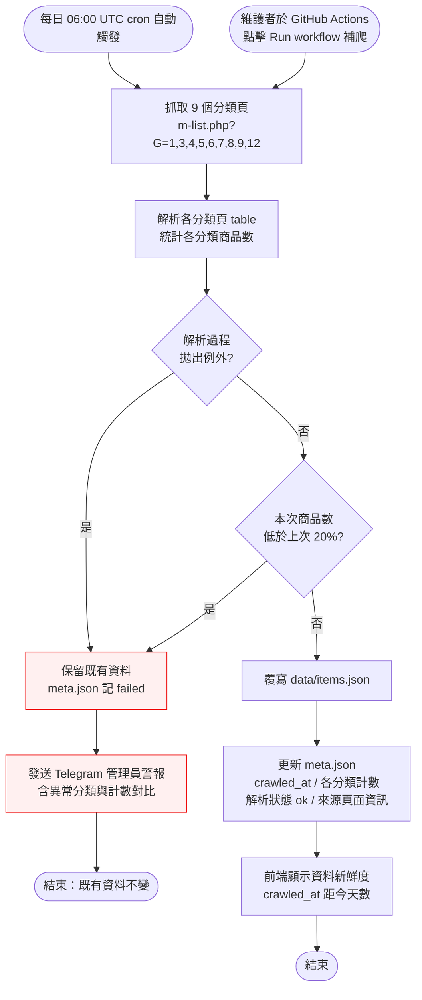

# Interaction Flow：007 爬蟲健康監控（crawler-health-monitoring）

> 對應技術決策：`docs/tech-decisions/tech-decision-原價屋商品價格追蹤-2026-08-15.md`（§5 風險登錄「原價屋改版 → parser 失效」之緩解措施、§4.1 P2 任務「健康監控」）
> 角色：**系統自動**（GitHub Actions cron 排程）+ **維護者**（手動補爬、接收 Telegram 警報）

---

## 1. 功能概述

**一句話描述**：爬蟲在每次執行時自動偵測解析異常（商品數驟降、parser 例外），異常時**保留既有資料、發出管理員 Telegram 警報**，並透過 `data/meta.json` 記錄健康指標、於前端顯示資料新鮮度。

**核心價值**：避免原價屋改版或網路異常導致網站商品資料被一次壞資料覆寫，讓維護者能在資料損壞前介入，並讓訪客一眼看出資料有多新。

---

## 2. 使用者與場景

| 項目 | 內容 |
|------|------|
| **角色** | ① **系統自動**：GitHub Actions cron 排程（每日 06:00 UTC = 台北 14:00）自動執行爬蟲 ② **維護者**：專案擁有者，可手動補爬、接收 Telegram 警報 ③ **訪客**（被動）：瀏覽前端頁面，觀看資料新鮮度 |
| **觸發入口** | ① 每日 06:00 UTC cron 自動觸發（主要） ② 維護者在 GitHub Actions 頁面點擊「Run workflow」手動補爬 ③ 前端頁面載入時讀取 `meta.json` 顯示新鮮度 |
| **前置條件** | ① 爬蟲已配置 9 個分類頁（G=1,3,4,5,6,7,8,9,12） ② 管理員 Telegram 機器人已設定 ③ `data/` 目錄存在（首次執行時由爬蟲建立） |
| **使用情境** | 每日爬蟲自動執行；原價屋改版 / 網路不穩 / 排程延遲時，維護者收到警報並手動補爬；訪客隨時查看資料新鮮度判斷是否可信 |

---

## 3. 操作流程圖

---

## 4. 逐步互動說明

### 步驟 1：觸發爬蟲執行

| | 描述 |
|---|------|
| **觸發** | GitHub Actions cron 每日 06:00 UTC 自動觸發；或維護者在 GitHub Actions 頁面點擊「Run workflow」（workflow_dispatch）手動補爬 |
| **操作前** | 系統：上一個執行週期結束，處於待命狀態；維護者：已開啟 workflow 頁面 |
| **系統回應** | workflow 啟動，進入 fetcher 抓取階段 |
| **操作後** | 爬蟲開始執行 |
| **下一步** | 步驟 2：抓取 9 個分類頁 |

### 步驟 2：抓取 9 個分類頁

| | 描述 |
|---|------|
| **觸發** | 系統自動執行 fetcher |
| **操作前** | workflow 已啟動 |
| **系統回應** | 依序抓取 `m-list.php?G=1,3,4,5,6,7,8,9,12` 共 9 頁（Big5 解碼、UA、自動 retry） |
| **操作後** | 取得 9 個分類頁 HTML（可能部分頁失敗） |
| **下一步** | 步驟 3：解析分類頁並統計商品數 |

### 步驟 3：解析分類頁並統計商品數

| | 描述 |
|---|------|
| **觸發** | 系統自動執行 parser |
| **操作前** | 已取得分類頁 HTML |
| **系統回應** | 解析 table → 商品列，統計各分類商品數與本次總數 |
| **操作後** | 產生本次各分類商品數清單 |
| **下一步** | 步驟 4：健康檢查 |

### 步驟 4：健康檢查（商品數驟降偵測）

| | 描述 |
|---|------|
| **觸發** | 系統自動比對 `data/meta.json` 中的上次計數 |
| **操作前** | 已取得本次計數；meta.json 存有上次計數（**首次執行除外**，跳過驟降偵測） |
| **系統回應** | 若本次商品數較上次**低於 20%**（本次 < 上次 × 80%）→ 判定解析異常；否則正常 |
| **操作後** | 得到判定結果：正常 → 步驟 5；異常 → 步驟 6 |
| **下一步** | 正常 → 步驟 5；異常 → 步驟 6 |

### 步驟 5：覆寫資料並更新健康指標（正常路徑）

| | 描述 |
|---|------|
| **觸發** | 健康檢查通過 |
| **操作前** | 資料判定正常 |
| **系統回應** | 覆寫 `data/items.json` 為本次最新資料；`data/meta.json` 記錄 crawled_at（ISO 8601）、各分類商品數、解析狀態 `ok`、來源頁面資訊（URL / G 索引 / 抓取結果） |
| **操作後** | 資料更新完成，meta.json 為最新健康指標 |
| **下一步** | 步驟 8：前端顯示資料新鮮度 |

### 步驟 6：保留舊資料並記錄異常（異常路徑）

| | 描述 |
|---|------|
| **觸發** | 商品數驟降超過 20% 或 parser 拋出例外 |
| **操作前** | 既有 `items.json` 與 `meta.json` 內容完整 |
| **系統回應** | **不覆寫** items.json；meta.json 解析狀態記錄為 `failed`（全部失敗）或 `partial`（部分分類失敗），並記錄異常原因與本次/上次計數 |
| **操作後** | 既有資料保持不變，異常狀態已記錄 |
| **下一步** | 步驟 7：發送 Telegram 管理員警報 |

### 步驟 7：發送 Telegram 管理員警報

| | 描述 |
|---|------|
| **觸發** | 異常狀態成立 |
| **操作前** | 異常已記錄於 meta.json |
| **系統回應** | 發送訊息至管理員 Telegram，內容含：異常類型（商品數驟降 / parser 例外 / 抓取失敗）、失敗分類清單、本次與上次商品數對比 |
| **操作後** | 管理員收到警報，可決定是否手動補爬 |
| **下一步** | 結束（既有資料不變） |

### 步驟 8：前端顯示資料新鮮度

| | 描述 |
|---|------|
| **觸發** | 前端頁面載入，讀取資料 API 的 `crawled_at` |
| **操作前** | `crawled_at` 已更新（或維持上次內容） |
| **系統回應** | 前端依 `crawled_at` 距今天數顯示：0 天「更新於今日」、1 天「更新於昨日」、≥2 天「更新於 N 天前」；超過 7 天顯示「資料可能過期」提示 |
| **操作後** | 訪客可看到資料新鮮度，判斷資料可信度 |
| **下一步** | 結束 |

---

## 5. 異常處理

| 錯誤情境 | 系統行為（維護者/訪客看到的回饋） | 恢復路徑 |
|---------|----------------------------------|---------|
| **商品數驟降**：本次商品數較上次低於 20% | 不覆寫 items.json；meta.json 狀態 `failed` 並記錄異常原因；發送 Telegram 管理員警報（含本次/上次計數） | 維護者檢查原價屋是否改版或來源異常，確認無誤後以 workflow_dispatch 手動補爬 |
| **parser 拋例外**：原價屋改版導致 HTML 結構無法解析 | 保留舊資料不覆寫；meta.json 狀態 `failed`；發送 Telegram 管理員警報（含失敗分類與例外訊息） | 維護者檢視 workflow log，修正 parser 後手動補爬 |
| **部分分類頁抓取失敗**（retry 後仍失敗） | 成功分類正常更新，失敗分類保留舊資料；meta.json 狀態 `partial`；發送 Telegram 管理員警報（含失敗分類清單） | 維護者確認網路/來源狀態後手動補爬 |
| **全部分類頁抓取失敗**（retry 後仍失敗） | 不覆寫 items.json；meta.json 狀態 `failed`；發送 Telegram 管理員警報 | 維護者確認原價屋連線狀態後手動補爬 |
| **首次執行**（meta.json 不存在） | 無上次基準，跳過驟降偵測；直接寫入首次資料；meta.json 狀態 `ok`；**不發警報** | 無需恢復 |

---

## 6. 邊界與限制

| 項目 | 內容 |
|------|------|
| **驟降門檻** | 硬性規則：本次商品數 < 上次 × 80%（即較上次低於 20%）才判定異常；**恰好等於 80% 不判定異常** |
| **首次執行** | 無 meta.json 基準時跳過驟降偵測，直接寫入 |
| **部分失敗語意** | 單一/數個分類失敗不影響其他分類：成功分類更新、失敗分類保留舊資料，整體狀態 `partial`；全部失敗才為 `failed` |
| **前端新鮮度顯示** | 0 天「今日」、1 天「昨日」、≥2 天「N 天前」、>7 天加註「資料可能過期」 |
| **警報範圍** | Telegram 警報僅發送管理員，不干擾一般使用者；警報為單向通知，不要求回覆 |
| **手動補爬** | workflow_dispatch 可隨時觸發，但**同樣受健康檢查保護**，無法繞過驟降偵測 |
| **資料一致性** | 異常時不覆寫既有 items.json；meta.json 的健康指標仍需更新（記錄異常），兩者分離 |
| **來源範圍** | 僅監控 9 個追蹤分類（G=1,3,4,5,6,7,8,9,12），不涵蓋全站 6,626 商品 |

---

## 7. 驗收檢查清單

- [ ] 商品數正常時，`data/items.json` 被覆寫為本次資料，且 `meta.json` 解析狀態為 `ok`
- [ ] 本次商品數較上次低於 20% 時，`data/items.json` **不被覆寫**，維持既有資料
- [ ] 商品數驟降時，發送 Telegram 警報給管理員，內容含異常分類與本次/上次計數
- [ ] parser 解析過程拋出例外時，保留舊資料且發送 Telegram 管理員警報
- [ ] 全部分類頁抓取失敗時，狀態為 `failed`；部分分類失敗時，成功分類更新、失敗分類保留舊資料，狀態為 `partial`
- [ ] 首次執行（無 meta.json）時跳過驟降偵測、直接寫入、不發警報
- [ ] `data/meta.json` 記錄 `crawled_at`（ISO 8601）、各分類商品數、解析狀態（`ok`/`partial`/`failed`）、來源頁面資訊（URL、G 索引、抓取結果）
- [ ] 前端依 `crawled_at` 顯示新鮮度：「今日」/「昨日」/「N 天前」，超過 7 天顯示「資料可能過期」
- [ ] 維護者可透過 workflow_dispatch 手動補爬，且補爬同樣受健康檢查保護
- [ ] 手動補爬成功且商品數正常時，資料正常更新且 meta.json 狀態為 `ok`
