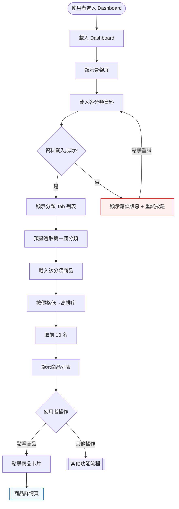

# Dashboard — 查看分類最便宜商品（US-01）— 互動流程

> **Issue**：#17
> **User Story**：US-01
> **Parent**：#16 Dashboard

---

## 1. 功能概述

**一句話**：讓使用者在 Dashboard 看到每個分類中最便宜的商品列表，一目瞭然掌握市場行情。

---

## 2. 使用者與場景

### 2.1 觸發入口

| 入口 | 說明 |
|------|------|
| 導覽列「Dashboard」連結 | 主要入口 |
| URL 直接進入 `/#/dashboard` | 分享連結或書籤 |

### 2.2 前置條件

- ☑ 無需登入
- ☑ API 資料已就緒（`api/items/{g}.json`）

---

## 3. 操作流程圖

---

## 4. 逐步互動說明

### 步驟 1：進入 Dashboard

| | 描述 |
|---|------|
| **觸發** | 使用者點擊導覽列「Dashboard」或直接訪問 `/#/dashboard` |
| **操作前** | 使用者在任意頁面 |
| **系統回應** | 顯示全頁骨架屏（skeleton loading），各分類區塊有佔位動畫 |
| **操作後** | Dashboard 頁面載入中，骨架屏持續顯示 |
| **下一步** | 步驟 2：資料載入完成 |

### 步驟 2：資料載入完成

| | 描述 |
|---|------|
| **觸發** | API 回應成功 |
| **操作前** | 骨架屏顯示中 |
| **系統回應** | 骨架屏淡出，顯示分類 Tab 列表 + 預設分類的商品列表 |
| **操作後** | 顯示完整的 Dashboard，預設選取第一個分類（如 CPU） |
| **下一步** | 步驟 3：瀏覽商品 |

### 步驟 3：瀏覽商品列表

| | 描述 |
|---|------|
| **觸發** | 商品列表載入完成 |
| **操作前** | 分類 Tab 已選取 |
| **系統回應** | 顯示前 10 名最便宜商品，每張卡片含：商品名稱、目前價格、歷史最低價、規格摘要 |
| **操作後** | 使用者可瀏覽商品，最便宜者標示 🥇 |
| **下一步** | 點擊商品詳情或執行其他操作 |

---

## 5. 異常處理

| 情境 | 使用者看到 | 恢復路徑 |
|------|-----------|---------|
| API 載入失敗 | 錯誤頁面：「無法載入資料」+ [重試] 按鈕 | 點擊重試 |
| 分類無商品 | 空狀態：「暫無商品資料」+ 圖示 | 無（資料真的為空） |

---

## 6. 驗收檢查清單

- [ ] Dashboard 頁面可正常訪問
- [ ] 顯示各分類 Tab 列表
- [ ] 預設選取第一個分類
- [ ] 每分類顯示前 10 名最便宜商品
- [ ] 商品卡片顯示：名稱、價格、規格摘要
- [ ] 價格正確格式化（千分位）
- [ ] 歷史最低價正確顯示
- [ ] 歷史新低徽章正確標示
- [ ] 已下架商品顯示「已下架」標籤
- [ ] 載入中顯示骨架屏
- [ ] API 失敗顯示錯誤頁面 + 重試按鈕
