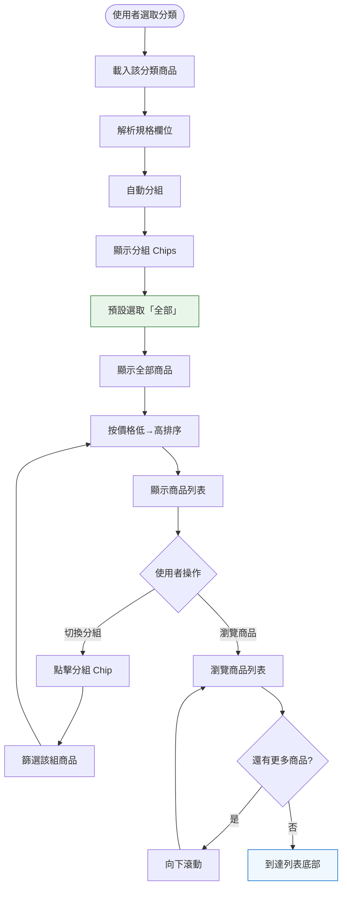
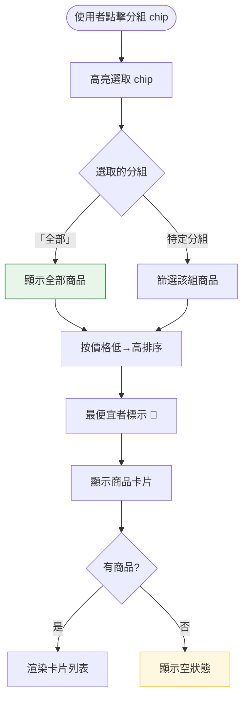

# Dashboard — 依規格分組比較商品（US-02）— 互動流程

> **Issue**：#18
> **User Story**：US-02
> **Parent**：#16 Dashboard
> **依賴**：#17 (US-01)
> **關聯 Tech Decision**：`docs/tech-decisions/018-dashboard-groups.md`
> **關聯 BDD**：`docs/bdds/018-dashboard-groups.feature`

---

## 1. 功能概述

**一句話**：將同規格商品自動分組（如 DDR5 32GB、DDR4 16GB），讓使用者精確比較同規格商品的價格差異。

核心交互元件：
1. **SpecGroupChips**：分組 Chips 列表，含「全部」預設選項，>8 個時折疊為「更多 ▼」
2. **DashboardCard**：商品卡片，每組最便宜者標示 🥇 金牌
3. **useSpecGroups composable**：client-side 分組邏輯（分組 → 篩選 → 排序）

---

## 2. 使用者與場景

### 2.1 使用者角色

| 角色 | 目標 |
|------|------|
| **裝機玩家** | 找特定規格最便宜的商品 |
| **比價消費者** | 跨品牌比較同規格商品 |

### 2.2 觸發入口

| 入口 | 說明 |
|------|------|
| 選取特定分類後自動觸發 | 記憶體、顯示卡、SSD 等支援分組的分類（由 `GROUP_STRATEGY` 配置決定） |
| 分組 Chips / Tabs | 使用者點擊切換不同規格組 |

### 2.3 顯示條件

- 分組 Chips 僅在 `hasGroups = true` 時顯示（即該分類有策略配置 + 至少 2 個分組含商品）
- 不支援分組的分類（如「其他」分類無策略配置）不顯示 Chips，直接顯示全部商品

---

## 3. 操作流程圖

### 3.1 分組切換子流程

---

## 4. 逐步互動說明

### 步驟 1：選取分類觸發分組

| | 描述 |
|---|------|
| **觸發** | 使用者選取支援分組的分類（如「記憶體」） |
| **操作前** | Dashboard 頁面已載入 |
| **系統回應** | 解析該分類所有商品的 `spec` 欄位，依 `GROUP_STRATEGY` 配置自動產生分組 |
| **操作後** | 顯示分組 Chips：**「全部」**（預設選取）+ 各規格組（如 [DDR5 32GB] [DDR5 16GB] [DDR4 16GB]...），每個 Chip 旁顯示該組商品數量 |
| **下一步** | 步驟 2：瀏覽商品（目前顯示全部商品） |

> ⚠️ **與先前版本差異**：「全部」為第一個 Chip 且預設選取，使用者初始看到所有商品，再點擊特定分組精確比較。

### 步驟 2：瀏覽商品列表

| | 描述 |
|---|------|
| **觸發** | 分組載入完成（預設「全部」選取） |
| **操作前** | 分組 Chips 已顯示，「全部」高亮 |
| **系統回應** | 顯示全部商品（或特定分組商品），按價格低→高排序；**最便宜者標示 🥇 金牌**（金色獎牌 emoji + 「最低」文字標籤） |
| **操作後** | 使用者可瀏覽商品列表，查看價格、規格、歷史趨勢 |
| **下一步** | 步驟 3：切換分組（可選） |

### 步驟 3：切換分組

| | 描述 |
|---|------|
| **觸發** | 使用者點擊特定分組 Chip（如「DDR4 16GB」） |
| **操作前** | 目前顯示全部商品（或前一個分組商品） |
| **系統回應** | Chip 高亮切換，列表立即篩選（client-side，**無 loading 動畫**，<300ms）；**該分組最便宜者重新標示 🥇** |
| **操作後** | 僅顯示該分組商品（如 DDR4 16GB），按價格低→高排序 |
| **下一步** | 繼續瀏覽、切換其他分組、或點擊「全部」回到全覽 |

> ⚠️ **「其他」分組**：無規格資料的商品自動歸入「其他」分組，但「其他」**不出現在 Chips 中**。這些商品僅在「全部」分組中可見。此為刻意設計——「其他」含義不清，不適合作為分組標籤。

---

## 5. 異常處理

| 情境 | 使用者看到 | 恢復路徑 |
|------|-----------|---------|
| 商品無規格資料 | 歸入「其他」分組，不出現在 Chips 中；在「全部」分組中可見 | 無（正常行為） |
| 分組無商品 | 空狀態：「暫無此規格商品」+ 建議切換分組 | 切換其他分組或「全部」 |
| 分組 Chips > 8 個 | 顯示前 7 個分組 + 「更多 (N) ▼」折疊按鈕（N = 被折疊的分組數） | 點擊「更多」展開；展開後按鈕變為「收起 ▲」 |
| 該分類不支援分組 | 不顯示分組 Chips，直接顯示全部商品 | 無（正常行為） |
| 該分類所有商品均無規格 | 不顯示分組 Chips（`hasGroups = false`），顯示全部商品 | 無（正常行為） |

---

## 6. 邊界與限制

| 項目 | 限制 | 說明 |
|------|------|------|
| 分組 chips 數量 | 最多顯示 7 個 + 「更多」按鈕 | 第 8 個起折疊為「更多 (N) ▼」 |
| 分組切換時間 | < 300ms | client-side 篩選，無 API 呼叫 |
| 「全部」分組 | 預設選取，永遠顯示 | 顯示所有商品（含無規格者） |
| 「其他」分組 | 不顯示在 Chips 中 | 無規格商品僅在「全部」中可見 |
| 🥇 金牌標示 | 每組（含「全部」）最便宜者標示 | 切換分組後重新計算 |
| Chip count | 每個 Chip 旁顯示該組商品數量 | 如「DDR5 32GB (12)」 |

---

## 7. 驗收檢查清單

- [ ] 分組 Chips 第一個為「全部」且預設選取
- [ ] 規格分組自動正確（DDR3/DDR4/DDR5 × 容量）
- [ ] 分組 Chips 正確顯示所有規格組合 + 商品數量
- [ ] 切換分組正確篩選商品（client-side，無 loading）
- [ ] 最便宜者標示 🥇 金牌
- [ ] 切換分組後🥇重新計算
- [ ] 無規格商品不出現在 Chips 中，但在「全部」分組可見
- [ ] 分組 chips > 8 個時折疊為「更多 (N) ▼」
- [ ] 展開/收起折疊按鈕正常運作
- [ ] 切換分組時間 < 300ms
- [ ] 分組無商品時顯示空狀態
- [ ] 不支援分組的分類不顯示 Chips

---

## 8. 與 BDD 交叉引用

| BDD Scenario | 互動流程對應 | 備註 |
|-------------|-------------|------|
| 自動產生分組 Chips | §4 步驟 1 | ✅ 一致（但 BDD 未提「全部」Chip） |
| 預設顯示最便宜商品標示 🥇 | §4 步驟 2 | ✅ 一致 |
| 切換分組後正確篩選 | §4 步驟 3 | ✅ 一致 |
| client-side 篩選無 loading | §4 步驟 3 | ✅ 一致 |
| 規格分組邏輯正確 | §4 步驟 1（GROUP_STRATEGY） | ✅ 一致 |
| 無規格商品歸入「其他」 | §5 異常處理 | ⚠️ BDD 說「不包含「其他」分組」但 Scenario 3 又說「切換至「其他」分組」——**BDD 自相矛盾**，本互動流程以 Tech Decision D7 為準（不出現在 Chips 中） |
| 每次切換分組🥇重新標示 | §4 步驟 3 | ✅ 一致 |
| 分組無商品時顯示空狀態 | §5 異常處理 | ✅ 一致 |
| Chips > 8 個折疊 | §5 異常處理、§6 邊界 | ✅ 一致 |
| 點擊「更多 ▼」展開 | §5 異常處理 | ✅ 一致 |
| 點擊「收起 ▲」折疊 | §5 異常處理 | ✅ 一致 |
| ≤ 8 個不顯示折疊按鈕 | §6 邊界 | ✅ 一致 |
| 僅一種規格組合 | §6 邊界 | ✅ 一致 |
| 所有商品均無規格 | §6 邊界 | ✅ 一致 |
| 切換時間 < 300ms | §6 邊界 | ✅ 一致 |

### BDD 待修正項目

> ⚠️ 以下為 BDD `018-dashboard-groups.feature` 與本互動流程 / Tech Decision 的不一致，建議修正：

1. **Happy Path Scenario 1**：「預設選取第一個分組 Chip」→ 應改為「預設選取「全部」分組 Chip」
2. **Business Rules Scenario 2**：「分組 Chips 不包含「其他」分組」→ 正確，但 Scenario 3 說「切換至「其他」分組」矛盾——應改為「使用者在「全部」分組中可見無規格商品」或移除 Scenario 3（無規格商品不出現在 Chips 中，無法「切換至」）
