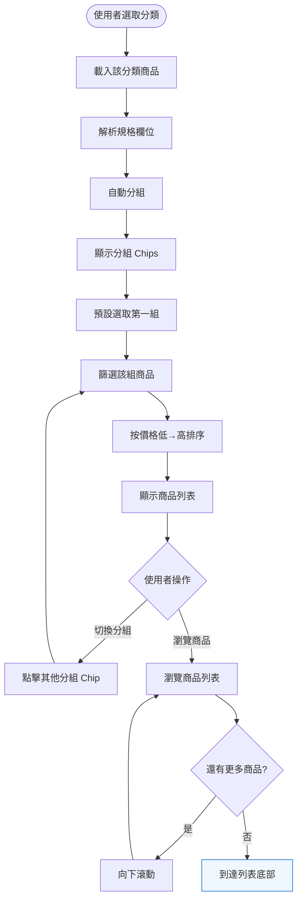
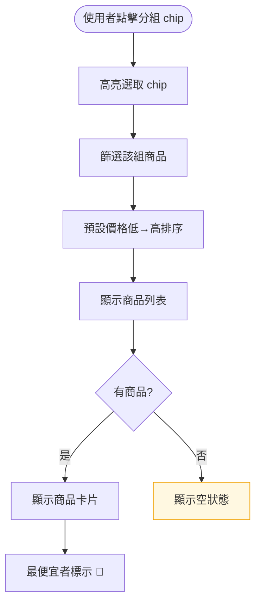

# Dashboard — 依規格分組比較商品（US-02）— 互動流程

> **Issue**：#18
> **User Story**：US-02
> **Parent**：#16 Dashboard
> **依賴**：#17 (US-01)

---

## 1. 功能概述

**一句話**：將同規格商品自動分組（如 DDR5 32GB、DDR4 16GB），讓使用者精確比較同規格商品的價格差異。

---

## 2. 使用者與場景

### 2.1 使用者角色

| 角色 | 目標 |
|------|------|
| **裝機玩家** | 找特定規格最便宜的商品 |
| **比價消費者** | 跨品牌比較同規格商品 |

### 2.2 觸發入口

| 入口 | 說明 |
|------|------|
| 選取特定分類後自動觸發 | 記憶體、顯示卡、SSD 等支援分組的分類 |
| 分組 Chips / Tabs | 使用者切換不同規格組 |

---

## 3. 操作流程圖

### 3.1 分組切換子流程

---

## 4. 逐步互動說明

### 步驟 1：選取分類觸發分組

| | 描述 |
|---|------|
| **觸發** | 使用者選取支援分組的分類（如「記憶體」） |
| **操作前** | Dashboard 頁面已載入 |
| **系統回應** | 解析該分類所有商品的 `spec.extra` 欄位，自動產生分組 |
| **操作後** | 顯示分組 Chips（如 [DDR5 32GB] [DDR5 16GB] [DDR4 16GB]...），預設選取第一組 |
| **下一步** | 步驟 2：瀏覽分組商品 |

### 步驟 2：瀏覽分組商品

| | 描述 |
|---|------|
| **觸發** | 分組載入完成 |
| **操作前** | 分組 Chips 已顯示 |
| **系統回應** | 僅顯示該分組商品，按價格低→高排序，最便宜者標示 🥇 |
| **操作後** | 使用者可瀏覽同規格商品列表 |
| **下一步** | 步驟 3：切換分組 |

### 步驟 3：切換分組

| | 描述 |
|---|------|
| **觸發** | 使用者點擊其他分組 Chip（如「DDR4 16GB」） |
| **操作前** | 目前顯示 DDR5 32GB 商品 |
| **系統回應** | Chip 高亮切換，列表立即篩選（client-side，無 loading） |
| **操作後** | 僅顯示 DDR4 16GB 商品，按價格低→高排序 |
| **下一步** | 繼續瀏覽或切換其他分組 |

---

## 5. 異常處理

| 情境 | 使用者看到 | 恢復路徑 |
|------|-----------|---------|
| 商品無規格資料 | 歸入「其他」分組 | 無（正常行為） |
| 分組無商品 | 空狀態：「暫無此規格商品」+ 建議切換分組 | 切換其他分組 |
| 分組 chips > 8 個 | 顯示「更多 ▼」折疊其餘分組 | 點擊「更多」展開 |

---

## 6. 邊界與限制

| 項目 | 限制 | 說明 |
|------|------|------|
| 分組 chips 數量 | 最多 8 個 | 超過折疊為「更多 ▼」 |
| 分組切換時間 | < 300ms | client-side 篩選 |

---

## 7. 驗收檢查清單

- [ ] 規格分組自動正確（DDR3/DDR4/DDR5 × 容量）
- [ ] 分組 Chips 正確顯示所有規格組合
- [ ] 切換分組正確篩選商品
- [ ] 最便宜者標示 🥇
- [ ] 無規格商品歸入「其他」分組
- [ ] 分組 chips > 8 個時折疊
- [ ] 切換分組時間 < 300ms
- [ ] 分組無商品時顯示空狀態
