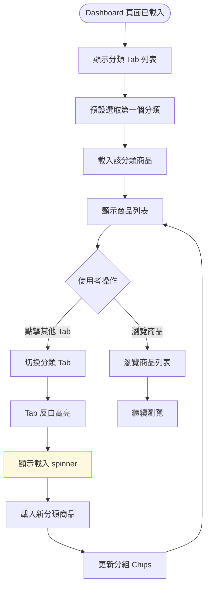

# Dashboard — 切換分類瀏覽（US-03）— 互動流程

> **Issue**：#19
> **User Story**：US-03
> **Parent**：#16 Dashboard

---

## 1. 功能概述

**一句話**：讓使用者在不同分類間快速切換（CPU / 記憶體 / 顯示卡...），一次比較多個分類的最便宜商品。

---

## 2. 使用者與場景

### 2.1 觸發入口

| 入口 | 說明 |
|------|------|
| Dashboard 頂部分類 Tab | 主要入口 |

### 2.2 前置條件

- ☑ Dashboard 頁面已載入
- ☑ API 資料已就緒

---

## 3. 操作流程圖

---

## 4. 逐步互動說明

### 步驟 1：檢視分類 Tab 列表

| | 描述 |
|---|------|
| **觸發** | Dashboard 頁面載入完成 |
| **操作前** | 骨架屏淡出 |
| **系統回應** | 顯示分類 Tab 列表（CPU、記憶體、顯示卡、SSD、主機板...） |
| **操作後** | 第一個分類 Tab 反白高亮，顯示該分類商品 |
| **下一步** | 步驟 2：切換分類 |

### 步驟 2：切換分類

| | 描述 |
|---|------|
| **觸發** | 使用者點擊分類 Tab（如「記憶體」） |
| **操作前** | 目前顯示 CPU 分類商品 |
| **系統回應** | Tab 反白高亮，顯示載入 spinner，載入記憶體分類商品 |
| **操作後** | 顯示記憶體分類商品，分組 chips 更新為記憶體規格（DDR3/4/5 × 容量） |
| **下一步** | 步驟 3：瀏覽新分類商品 |

### 步驟 3：瀏覽新分類商品

| | 描述 |
|---|------|
| **觸發** | 新分類商品載入完成 |
| **操作前** | 載入 spinner 顯示中 |
| **系統回應** | Spinner 淡出，顯示新分類商品列表 |
| **操作後** | 使用者可瀏覽新分類商品 |
| **下一步** | 繼續瀏覽或切換其他分類 |

---

## 5. 異常處理

| 情境 | 使用者看到 | 恢復路徑 |
|------|-----------|---------|
| 分類 Tab 超過 5 個 | 顯示「更多 ▼」折疊其餘分類 | 點擊「更多」展開 |
| 切換分類時上一個分類仍在載入 | 取消上一個請求，僅顯示最新分類 | 無（自動處理） |
| 新分類無商品 | 空狀態：「暫無商品資料」 | 切換其他分類 |

---

## 6. 驗收檢查清單

- [ ] 分類 Tab 列表正確顯示所有分類
- [ ] 預設選取第一個分類
- [ ] 切換分類後 Tab 反白高亮
- [ ] 切換分類後商品列表正確更新
- [ ] 切換分類後分組 Chips 正確更新
- [ ] 分類 Tab > 5 個時折疊
- [ ] 切換分類時顯示載入 spinner
- [ ] 切換分類時間 < 1 秒
