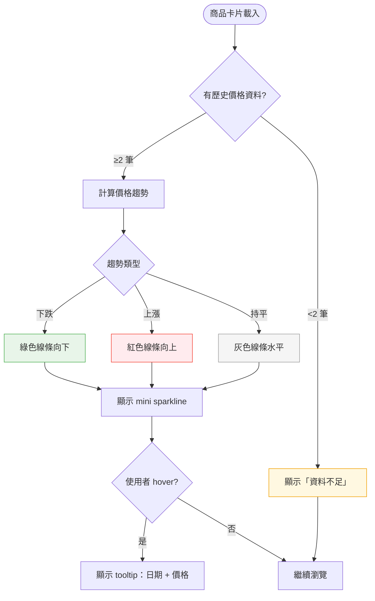

# Dashboard — 查看價格走勢（US-04）— 互動流程

> **Issue**：#20
> **User Story**：US-04
> **Parent**：#16 Dashboard
> **依賴**：#17 (US-01)
> **關聯 Tech Decision**：`docs/tech-decisions/020-dashboard-sparkline.md`（待產出）
> **關聯 BDD**：`docs/bdds/020-dashboard-sparkline.feature`（待產出）

---

## 1. 功能概述

**一句話**：在商品卡片上顯示價格走勢 mini sparkline，讓使用者快速判斷價格趨勢（漲/跌/持平）。

核心交互元件：
1. **Sparkline.vue**：SVG 迷你趨勢圖元件（polyline，viewBox 100×28）
2. **DashboardCard.vue**：商品卡片，整合 sparkline 顯示
3. **priceChange.ts**：漲跌計算共用純函數（trend 判定）

---

## 2. 使用者與場景

### 2.1 使用者角色

| 角色 | 目標 |
|------|------|
| **追蹤用戶** | 監控價格變動，判斷進場時機 |
| **比價消費者** | 了解價格趨勢，決定是否購買 |

### 2.2 觸發入口

| 入口 | 說明 |
|------|------|
| 商品卡片自動顯示 | 載入商品列表時，有歷史資料（≥2 筆）的商品自動渲染 sparkline |

### 2.3 顯示條件

- 商品需有 ≥2 筆歷史價格資料才顯示 sparkline（<2 筆顯示「資料不足」文字）
- 已下架商品（`status === 'gone'`）不顯示 sparkline
- sparkline 顯示在卡片價格區域旁（緊鄰目前價格）

---

## 3. 操作流程圖



---

## 4. 逐步互動說明

### 步驟 1：商品卡片載入

| | 描述 |
|---|------|
| **觸發** | 商品列表載入完成 |
| **操作前** | 商品卡片渲染中 |
| **系統回應** | 檢查每個商品的歷史價格資料（`item.history`） |
| **操作後** | ≥2 筆歷史資料的商品在卡片內顯示 sparkline；<2 筆的顯示「資料不足」文字 |
| **下一步** | 步驟 2：檢視 sparkline |

### 步驟 2：檢視 sparkline

| | 描述 |
|---|------|
| **觸發** | sparkline 渲染完成 |
| **操作前** | 商品卡片已顯示 |
| **系統回應** | sparkline 線條顏色反映價格趨勢：綠色（下跌）/ 紅色（上漲）/ 灰色（持平）；線條走勢與實際價格變化一致（高→低 = 下跌線條向下） |
| **操作後** | 使用者可一眼判斷價格趨勢方向與幅度 |
| **下一步** | 步驟 3：hover 查看詳情（選用） |

### 步驟 3：hover 查看詳情

| | 描述 |
|---|------|
| **觸發** | 使用者 hover sparkline 區域 |
| **操作前** | sparkline 已顯示 |
| **系統回應** | 顯示 tooltip，包含日期 + 價格（精確到該數據點） |
| **操作後** | 使用者可查看特定日期的歷史價格 |
| **下一步** | 移開 cursor 隱藏 tooltip |

---

## 5. 異常處理

| 情境 | 使用者看到 | 恢復路徑 |
|------|-----------|---------|
| 商品無歷史資料（0 筆） | 顯示「資料不足」文字 | 無（等待下次爬蟲更新） |
| 歷史資料僅 1 點 | 顯示「資料不足」文字（無法判斷趨勢） | 無（等待下次爬蟲更新） |
| 已下架商品 | 不顯示 sparkline，顯示「已下架」標籤 | 無（商品已下架） |
| 歷史資料跨多月 | 僅顯示最近 30 天資料（超過截斷） | 無（自動截斷） |

---

## 6. 邊界與限制

| 項目 | 限制 | 說明 |
|------|------|------|
| 最小資料筆數 | ≥2 筆才顯示 sparkline | <2 筆顯示「資料不足」文字 |
| 資料範圍 | 最近 30 天 | 超過 30 天的資料點不繪製 |
| Tooltip 內容 | 日期 + 價格 | 精確到單一數據點 |
| 趨勢判定 | 基於最後兩筆資料 | `current - previous`；diff<0 跌（綠）、diff>0 漲（紅）、diff=0 持平（灰） |
| Sparkline 尺寸 | viewBox 100×28，寬度 100% | 響應式，隨卡片寬度縮放 |

---

## 7. 驗收檢查清單

- [ ] ≥2 筆歷史資料的商品在卡片內顯示 sparkline
- [ ] <2 筆歷史資料的商品顯示「資料不足」文字
- [ ] 已下架商品不顯示 sparkline
- [ ] 價格下跌顯示綠色線條
- [ ] 價格上漲顯示紅色線條
- [ ] 價格持平顯示灰色線條
- [ ] Sparkline 線條走勢與實際價格變化一致
- [ ] Hover sparkline 顯示 tooltip（日期 + 價格）
- [ ] 移開 cursor 隱藏 tooltip
- [ ] 歷史資料跨多月時僅顯示最近 30 天
- [ ] Sparkline 響應式縮放（隨卡片寬度）

---

## 8. 與現有實作的差異（⚠️ 待補齊）

> 以下為本互動流程描述的功能與目前程式碼實作的差異，需在開發規格中規劃補齊。

| 功能點 | 互動流程描述 | 目前實作 | 狀態 |
|--------|-------------|---------|------|
| Sparkline 整合至 DashboardCard | 卡片內顯示 sparkline | `DashboardCard.vue` **未引入** Sparkline.vue | ❌ 未整合 |
| 趨勢顏色（綠/紅/灰） | 依 trend 動態著色 | Sparkline.vue 用 `var(--brand)` 統一顏色，無 trend 條件 | ❌ 未實作 |
| Hover tooltip | 顯示日期 + 價格 | Sparkline.vue **無 tooltip**，無 hover handler | ❌ 未實作 |
| 30 天資料截斷 | 僅顯示最近 30 天 | Sparkline.vue **無日期過濾**，直接畫所有 points | ❌ 未實作 |
| 無資料/1 點顯示 | 不顯示 sparkline | 顯示「資料不足」文字 | ⚠️ 差異（見 §6） |
| Trend 計算來源 | 基於最後兩筆 | `priceChange.ts` 已實作 `computePriceChange()`（共用函數） | ✅ 已有 |

### 已有可複用模組

| 模組 | 檔案 | 可用於 |
|------|------|--------|
| `computePriceChange()` | `lib/priceChange.ts` | Trend 判定（up/down/flat） |
| `priceChangeBadgeClass()` | `lib/priceChange.ts` | 趨勢 CSS class 對應（`price-up` / `price-down` / `price-flat`） |
| `usePriceDelta()` | `composables/usePriceDelta.ts` | 卡片漲跌狀態（已有 `deltaClass` / `deltaText`） |
| `PriceTrend` type | `lib/priceChange.ts` | `"up" | "down" | "flat" | null` — 可直接作為 Sparkline 的 trend prop 型別 |
| `Sparkline.vue` | `components/Sparkline.vue` | SVG 渲染（需擴充 trend prop + tooltip） |
| 30 天截斷模式 | `components/ProductCard.vue` L24 | `props.item.history.slice(-30)` — 已在 ProductCard 實作，DashboardCard 可直接複用 |

### 參考：ProductCard 的 Sparkline 整合方式

`ProductCard.vue`（ listing 頁卡片）已整合 Sparkline，可作為 DashboardCard 整合的參考：

```typescript
// ProductCard.vue — 30 天截斷 + Sparkline 渲染
import Sparkline from "./Sparkline.vue"
const sparkPoints = computed(() => props.item.history.slice(-30))
```

```html
<!-- ProductCard.vue template -->
<Sparkline :points="sparkPoints" />
```

**差異**：ProductCard 未傳入 trend prop（Sparkline 目前無 trend 著色），DashboardCard 需擴充 Sparkline 支援 trend-based 顏色。
